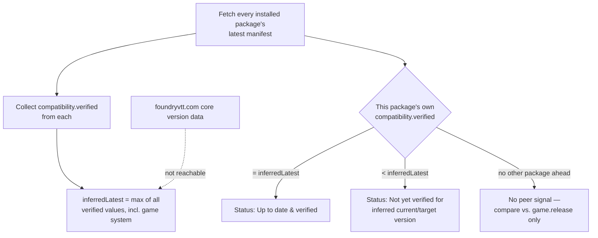

# ADR-0001: Infer a likely-newer Foundry version from installed packages' own manifests

> ## ⚠️ Amended 2026-08-15 — the premise below was factually wrong
>
> This ADR was written on research that incorrectly asserted Foundry does not
> expose the latest core version to a running world. **It does:**
> `game.data.coreUpdate.version` (measured: `"14.366"` in a world running
> `13.351`), with no credentials, no CORS, and no fetch by this module.
>
> **The decision is therefore revised** — see "Amendment" at the end of this
> document:
>
> - **Primary**: read the latest core version from `game.data.coreUpdate`.
> - **Fallback**: the peer inference this ADR originally chose
>   (`inferredLatest`) is retained for when `coreUpdate.couldReachWebsite`
>   is `false` or the field is absent.
>
> The original text is preserved below unedited, because the option analysis
> (proxy servers, license keys, HTML scraping) remains valid and its
> rejections still hold. Only the availability premise and the resulting
> primary mechanism changed. The title is left unchanged so existing
> references keep resolving, though it now describes the fallback rather
> than the primary path.

## Context and Problem Statement

The v1 scope calls for flagging packages that are "not yet verified for
current/target Foundry version" — i.e., comparing a package's declared
`compatibility.verified` against both the Foundry version a GM is currently
running *and* whatever newer version might already be available. The
"target" half of that check requires knowing the latest published Foundry
core version from inside a running world, with no server component and no
API keys.

[`docs/research/foundry-version-detection.md`](../research/foundry-version-detection.md)
tested this directly against foundryvtt.com: the release-notes pages carry
no `Access-Control-Allow-Origin` header (so a cross-origin `fetch()` from a
GM's world is rejected by the browser before we ever see a response body),
and there is no RSS/JSON release feed. `game.release` only exposes the
version of the client that's currently running, not the latest one
published.

The one endpoint found with open CORS, `/_api/packages/get`, turned out to
be a dead end for a different reason, not just CORS: it 403s without a
privileged key. Further research into how Foundry's *own* "Check for
Update" feature works (GitHub issue `foundryvtt/foundryvtt#11024`, and the
official package-management docs) confirmed why — that check is gated to
the pre-login Setup screen, authenticated by the world owner's Foundry
license key, and there is no evidence that key or its derived token is ever
exposed to a running world's client bundle. So the wall isn't generic CORS
policy; it's that Foundry deliberately keeps "is a newer core version out"
behind license auth that a world-side module cannot reach without asking
GMs to hand over their license key — which is both explicitly out of scope
(no API keys) and a real security/privacy concern to ask of GMs.

An earlier version of this ADR concluded from that wall that v1 should
simply compare against the *running* Foundry version and document the gap.
That's an incomplete answer: it only catches "you already upgraded and your
mods haven't caught up" (the same gap Foundry's own setup-screen checklist
already covers) and is silent on the *predictive* question — "should I
upgrade at all" — which is the actual demand signal called out in the mcc
research (issue #31: "check if installed modules have versions for higher
Foundry versions than currently used"). A manually-entered target version
was also considered and rejected as the answer: it still requires the GM to
do something, which is the exact gap this module exists to close.

Given that no automatic, credential-free way exists to ask Foundry itself
"what's the latest version," is there another source of truth we're not
using?

## Decision Drivers

* No server component, no API keys — a hard v1 constraint (this module
  exists specifically because `arcanistzed/mcc`'s privileged-key + worker
  dependency was a major reason it died — see
  [`docs/research/mcc-research.md`](../research/mcc-research.md))
* Must be fully automatic — no GM action required. A checker that only
  works if the GM already knows the answer isn't solving the problem it
  exists for.
* KISS — prefer the boring, honest answer over a clever workaround
* Never present a compatibility claim as more certain than it is (project
  rule: dev-declared, not tested)
* Ship v1 rather than block on an unsolvable client-side problem

## Considered Options

* Compare only against the currently running Foundry version; document the
  gap as a known limitation
* Build a small proxy/relay service to fetch latest-version info
  server-side, expose it over CORS
* Work around the missing CORS headers by scraping the release-notes HTML
  through an opaque-response trick
* Reuse Foundry's own license-authenticated update endpoint by asking the
  GM to supply their Foundry license key
* Let the GM manually enter/select a "target version" to check against,
  instead of auto-detecting it
* Infer a likely-newer Foundry version from the highest
  `compatibility.verified` already declared across the GM's own installed
  packages

## Decision Outcome

Chosen option: "Infer a likely-newer Foundry version from installed
packages' own manifests," because it's the only option that is both fully
automatic and compliant with the no-server/no-API-key constraint. We're
already fetching every installed package's latest published manifest for
the core v1 update check (no new network calls). Actively-maintained
packages — especially the active game system, and fast-moving libraries
like lib-wrapper — typically bump `compatibility.verified` within days of a
new Foundry release, often before most GMs have upgraded. Taking the
highest `compatibility.verified` observed across everything a GM has
installed as a proxy for "a newer Foundry generation likely exists" turns
data we already have into the missing signal, with zero new infrastructure
and zero credentials.

This is an inference, not a fact, and is documented as such everywhere it
surfaces (UI, README, generated status text) — see ADR-0002 for how
confidence in this signal maps to status severity, so a single
early-updating package doesn't get treated the same as strong, corroborated
evidence.

### Consequences

* Good, because it requires no infrastructure and can't rot the way mcc's
  worker + spreadsheet dependency did.
* Good, because it's fully automatic — no GM has to already know the
  answer for the checker to be useful, which was the core objection to
  both the running-version-only and manual-entry alternatives.
* Good, because it directly answers the demand signal from mcc issue #31
  ("check if installed modules have versions for higher Foundry versions
  than currently used") without violating any v1 constraint.
* Good, because it strengthens the "possibly unmaintained" heuristic, which
  already needed exactly this signal (a newer Foundry generation existing)
  and previously had no way to get it.
* Bad, because it's a lower bound inferred from peers, not ground truth —
  if every installed package is equally behind, there's no peer signal at
  all, and the checker silently degrades to "no evidence either way" (the
  same as the running-version-only design, not worse).
* Bad, because it's inference, not certainty — a package could simply have
  a slow developer rather than an actual missed core release. This is
  mitigated, not eliminated, by treating the resulting status as low
  confidence unless corroborated (ADR-0002).
* Neutral, because if foundryvtt.com ever exposes a public, CORS-friendly
  "latest release" endpoint, this inference becomes unnecessary and this
  decision should be revisited.

### Confirmation

The checker table and login notification (v1 scope, item 2) compute an
"inferred latest version" as `max(compatibility.verified)` across all
currently-installed packages and the active game system, and compare each
package's own `verified` against that inferred value in addition to
`game.release`. There is no target-version input field or GM-facing setting
for this anywhere in the codebase — the entire signal is derived from
manifest data the core v1 update check already fetches. Code review against
this ADR should reject any change that reintroduces a manual "target
version" input as the primary mechanism, or that calls foundryvtt.com
directly for core version data.

## Pros and Cons of the Options

### Compare only against the currently running Foundry version

* Good, because it needs no network calls beyond the manifest fetches v1
  already makes.
* Good, because it can't silently go stale or break when a third-party
  service changes.
* Bad, because it under-delivers on the original "target version" framing
  in the v1 scope — it only ever tells a GM about a gap after they've
  already upgraded, never before.

### Proxy/relay service

* Good, because it would fully solve the problem — a server can see
  whatever it wants.
* Bad, because it's explicitly out of scope (project rule 5, and the
  "Do not build a proxy server" instruction) precisely because this is the
  architecture that killed mcc: standing infrastructure one volunteer has
  to maintain forever, with no clean handoff path.
* Bad, because it reintroduces the single-point-of-failure risk this
  module was designed to avoid.

### Scrape release-notes HTML around the missing CORS headers

* Neutral, because it's technically possible in narrow cases, but none of
  the available tricks reliably yield the actual latest version string.
* Bad, because it depends on foundryvtt.com's HTML structure staying
  stable, with no notice if it changes — brittle in a way that violates
  KISS.
* Bad, because it's an adversarial use of a site that has deliberately not
  exposed this endpoint publicly; a future ToS or CORS-policy change could
  break it without warning.

### Reuse Foundry's license-authenticated update endpoint

* Good, because it's the one endpoint that actually has the ground truth
  and open CORS — if we could use it, it would fully solve the problem.
* Bad, because it requires the GM's Foundry license key, which is an "API
  key" by any reasonable definition and explicitly out of scope.
* Bad, because asking a third-party module to collect a GM's software
  license key is a real security and privacy concern independent of the
  project's own constraints — it's exactly the kind of credential
  collection this whole class of module should avoid.

### Manual "target version" entry by the GM

* Good, because it sidesteps the detection problem entirely — the GM
  already knows what version they're planning to upgrade to.
* Good, because it directly answers the demand signal from mcc issue #31.
* Bad, because it still requires the GM to take action and already know
  the answer, which is the exact gap this module exists to close — a
  checker that only works when you already know what it would tell you
  isn't solving the problem.
* Neutral, because nothing about the chosen decision blocks adding this
  later as an optional supplement for GMs who know something the peer
  inference hasn't caught up to yet (e.g., day one after a Foundry release,
  before any installed package has re-verified).

### Infer a likely-newer Foundry version from installed packages' own manifests (chosen)

* Good, because it's fully automatic and uses data already being fetched.
* Good, because it degrades gracefully — no false ground-truth claims, just
  silence when there's no peer signal.
* Neutral, because it produces a floor, not a ceiling — it can only ever
  suggest a newer version exists, never rule one out.
* Bad, because a single early-updating package could look like strong
  evidence when it isn't; addressed by requiring corroboration before
  escalating severity (see ADR-0002).

## Architecture Diagram



The dashed edge marks the check this ADR decided not to build directly:
there is no path from foundryvtt.com's own version data into the inference
— `inferredLatest` is derived entirely from manifests already being
fetched for the core v1 update check.

## More Information

* [`docs/research/foundry-version-detection.md`](../research/foundry-version-detection.md) —
  the research this decision is based on, including the exact endpoints
  tested and their CORS/auth behavior.
* [`docs/research/mcc-research.md`](../research/mcc-research.md) — prior
  art whose proxy/privileged-API-key architecture this decision deliberately
  avoids repeating.
* [`README.md`](../../README.md) § "How we detect a newer Foundry version"
  — the user-facing statement of this same decision.
* See ADR-0002 for how the status this inference produces maps to severity
  and notification behavior, so a weak peer signal doesn't get treated the
  same as a developer-declared hard incompatibility.
* Revisit if: foundryvtt.com publishes a public, unauthenticated,
  CORS-enabled "latest release" endpoint — the inference becomes
  unnecessary at that point.

## Amendment — 2026-08-15

### What was wrong

The "Context and Problem Statement" above asserts that there is no
credential-free way to learn the latest core version from inside a running
world. That is false. Foundry populates `game.data.coreUpdate` in the
client's own game data:

```js
game.data.coreUpdate
// { hasUpdate: false, canUpdate: true, couldReachWebsite: true,
//   version: "14.366", channel: "stable", willDisableModules: true }
```

Measured in a live Foundry v13.351 world as GM. The local Node server runs
the license-authenticated update check and relays the *result* to the
client. So the license-key barrier described above is real, but it never
prevented us from learning the answer — only from asking foundryvtt.com
ourselves, which was never necessary.

The error originated in
[`docs/research/foundry-version-detection.md`](../research/foundry-version-detection.md),
which claimed no such field existed in `game.data` without ever enumerating
`game.data`. That document now carries a Correction section covering the
evidence and the method failure. The foundryvtt.com CORS findings in it —
and every option rejection in this ADR — remain valid.

### Revised decision

`inferredLatest` is demoted from primary mechanism to fallback:

1. **Primary — `game.data.coreUpdate.version`.** Authoritative, zero
   network calls by this module, no credentials. Used whenever
   `couldReachWebsite` is `true` and `version` is present.
2. **Fallback — peer inference.** The original mechanism, unchanged, used
   when the Foundry server could not reach foundryvtt.com (`couldReachWebsite:
   false`) or the payload is absent. Its "no peer signal" degradation
   (documented above) still applies.

Two implementation constraints are binding:

- **Compare `coreUpdate.version` against `game.release.version` directly.**
  Do NOT gate on `coreUpdate.hasUpdate`: it read `false` while `version` read
  `14.366` on a world running `13.351`, appearing to be scoped to the current
  generation. Gating on it would suppress exactly the cross-generation signal
  this project exists to surface.
- **Treat `couldReachWebsite: false` as "unknown", not as "no update".**
  Absence of a reachable check is not evidence that the running version is
  current — the same reasoning this ADR already applies to a missing peer
  signal.

### What does not change

- The "no server component, no API keys" constraint holds — more strongly,
  in fact, since the primary path now makes no network request at all.
- Severity handling per ADR-0002 is unaffected. A target version obtained
  authoritatively still produces a soft status unless
  `compatibility.maximum` says otherwise.
- The rejections of a proxy/relay, license-key collection, HTML scraping,
  and manual target-version entry all stand.

### Related consequence

`game.data.systemUpdate` similarly exposes the active game system's latest
version (`{ hasUpdate: true, version: "14.0.2" }` for a system running
`0.30.1`) with no manifest fetch. This is relevant to SPEC-0002, since the
game system is one of the packages whose declared manifest URL is
CORS-blocked — verified independently against the system's GitHub releases,
which show a renumbering from `0.30.1` to the `14.x` line.

### Follow-up required

SPEC-0001 REQ "Inferred Latest Version" still specifies peer inference as
*the* mechanism and must be amended to match this primary/fallback split.
[`design.md`](../openspec/specs/compatibility-checker/design.md) likewise
restates the incorrect premise. Both are knowingly stale as of this
amendment and are tracked as follow-up work rather than being changed here,
so the spec/design pair can be amended together.
