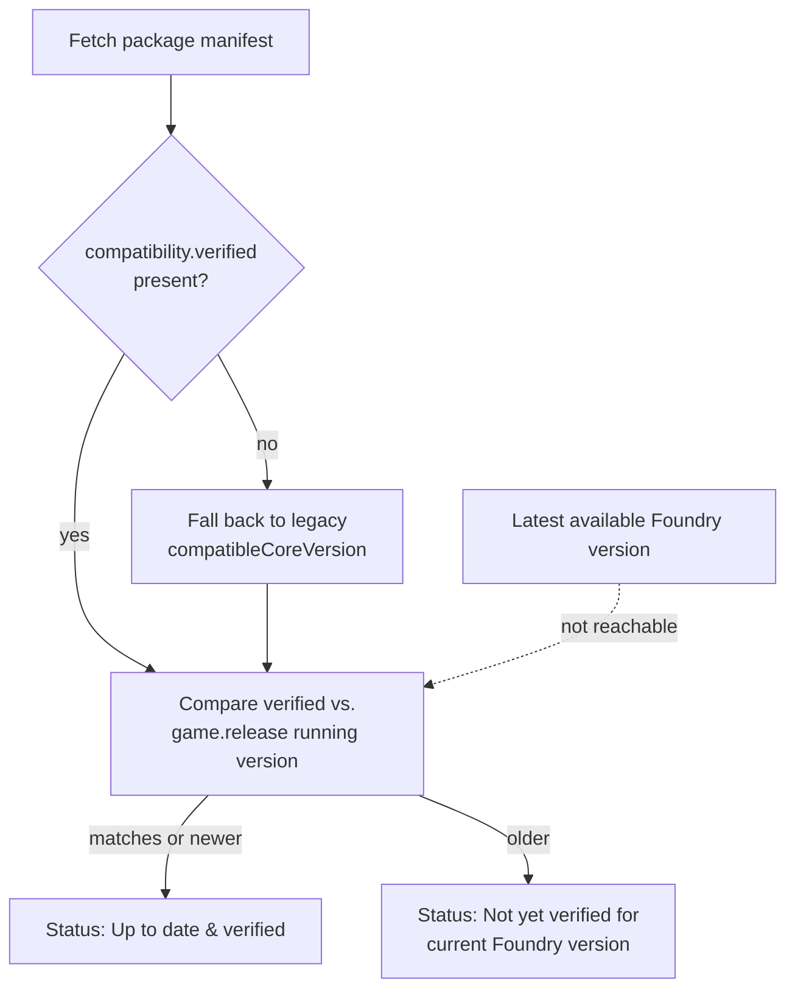

# ADR-0001: Limit compatibility checking to the currently running Foundry version

## Context and Problem Statement

The v1 scope calls for flagging packages that are "not yet verified for
current/target Foundry version" — i.e., comparing a package's declared
`compatibility.verified` against both the Foundry version a GM is currently
running *and* whatever newer version might already be available. The
"target" half of that check requires knowing the latest published Foundry
core version from inside a running world, with no server component and no
API keys.

[`docs/research/foundry-version-detection.md`](../research/foundry-version-detection.md)
tested this directly against foundryvtt.com: the release-notes pages carry
no `Access-Control-Allow-Origin` header (so a cross-origin `fetch()` from a
GM's world is rejected by the browser before we ever see a response body),
the one endpoint that *does* have open CORS (`/_api/packages/get`) requires
a privileged API key and returns `403` without one, and there is no
RSS/JSON release feed. `game.release` only exposes the version of the
client that's currently running, not the latest one published.

How should the checker behave given that "the latest available Foundry
version" is not something we can reliably know?

## Decision Drivers

* No server component, no API keys — a hard v1 constraint (this module
  exists specifically because `arcanistzed/mcc`'s privileged-key + worker
  dependency was a major reason it died — see
  [`docs/research/mcc-research.md`](../research/mcc-research.md))
* KISS — prefer the boring, honest answer over a clever workaround
* Never present a compatibility claim as more certain than it is (project
  rule: dev-declared, not tested)
* Ship v1 rather than block on an unsolvable client-side problem

## Considered Options

* Compare only against the currently running Foundry version; document the
  gap as a known limitation
* Build a small proxy/relay service to fetch latest-version info
  server-side, expose it over CORS
* Work around the missing CORS headers by scraping the release-notes HTML
  through an opaque-response trick (e.g. `no-cors` fetch, hidden
  `<iframe>`/`` probing)
* Let the GM manually enter/select a "target version" to check against,
  instead of auto-detecting it

## Decision Outcome

Chosen option: "Compare only against the currently running Foundry
version," because it's the only option that respects the no-server/no-API-key
constraint, doesn't depend on fragile scraping, and keeps the checker
honest about what it actually knows. The gap is called out explicitly in
the README's "Known limitation" section rather than silently swallowed.

### Consequences

* Good, because it requires no infrastructure and can't rot the way mcc's
  worker + spreadsheet dependency did.
* Good, because every status the checker reports is something we can
  actually stand behind — no risk of a false "verified for the version
  you'll upgrade to next."
* Bad, because a GM on an older Foundry version gets no signal on whether
  their packages are ready for a newer one they haven't installed yet —
  exactly the demand signal called out in the mcc research (issue #31:
  "check if installed modules have versions for higher Foundry versions").
* Neutral, because if foundryvtt.com ever exposes a public, CORS-friendly
  "latest release" endpoint, this decision should be revisited — the
  research doc says as much.

### Confirmation

The checker table and login notification (v1 scope, item 2) only ever
render a "verified core version" column and compare it to `game.release`;
there is no target-version input or forward-looking comparison anywhere in
the codebase. Code review against this ADR should reject any change that
tries to infer "latest available version" without a corresponding update
to this decision.

## Pros and Cons of the Options

### Compare only against the currently running Foundry version

* Good, because it needs no network calls beyond the manifest fetches v1
  already makes.
* Good, because it can't silently go stale or break when a third-party
  service changes.
* Bad, because it under-delivers on the original "target version" framing
  in the v1 scope — mitigated by documenting it as a known limitation
  rather than pretending the check is more complete than it is.

### Proxy/relay service

* Good, because it would fully solve the problem — a server can see
  whatever it wants.
* Bad, because it's explicitly out of scope (project rule 5, and the
  "Do not build a proxy server" instruction) precisely because this is the
  architecture that killed mcc: standing infrastructure one volunteer has
  to maintain forever, with no clean handoff path.
* Bad, because it reintroduces the single-point-of-failure risk this
  module was designed to avoid.

### Scrape release-notes HTML around the missing CORS headers

* Neutral, because it's technically possible in narrow cases (e.g. a
  same-origin proxy, or reading an opaque response's status without its
  body), but none of the available tricks reliably yield the actual latest
  version string.
* Bad, because it depends on foundryvtt.com's HTML structure staying
  stable, with no notice if it changes — brittle in a way that violates
  KISS.
* Bad, because it's an adversarial use of a site that has deliberately not
  exposed this endpoint publicly; a future ToS or CORS-policy change could
  break it without warning.

### Manual "target version" entry by the GM

* Good, because it sidesteps the detection problem entirely — the GM
  already knows what version they're planning to upgrade to.
* Good, because it directly answers the demand signal from mcc issue #31.
* Bad, because it's an extra UI surface and a setting to keep in sync,
  which is more than v1's "ship the boring thing" scope calls for.
* Neutral, because nothing about the current decision blocks adding this
  later — it composes cleanly with "compare only against running version"
  as the default, with an optional manual override. Worth revisiting as a
  v1.5 candidate once the core checker ships.

## Architecture Diagram

The dashed edge marks the check this ADR decided *not* to build: there is
no path from "latest available Foundry version" into the comparison logic.

## More Information

* [`docs/research/foundry-version-detection.md`](../research/foundry-version-detection.md) —
  the research this decision is based on, including the exact endpoints
  tested and their CORS/auth behavior.
* [`docs/research/mcc-research.md`](../research/mcc-research.md) — prior
  art whose proxy/privileged-API-key architecture this decision deliberately
  avoids repeating.
* [`README.md`](../../README.md) § "Known limitation: no forward-looking
  version check" — the user-facing statement of this same decision.
* Revisit if: foundryvtt.com publishes a public, unauthenticated,
  CORS-enabled "latest release" endpoint, or if manual target-version entry
  (considered option 4) is prioritized for v1.5.
