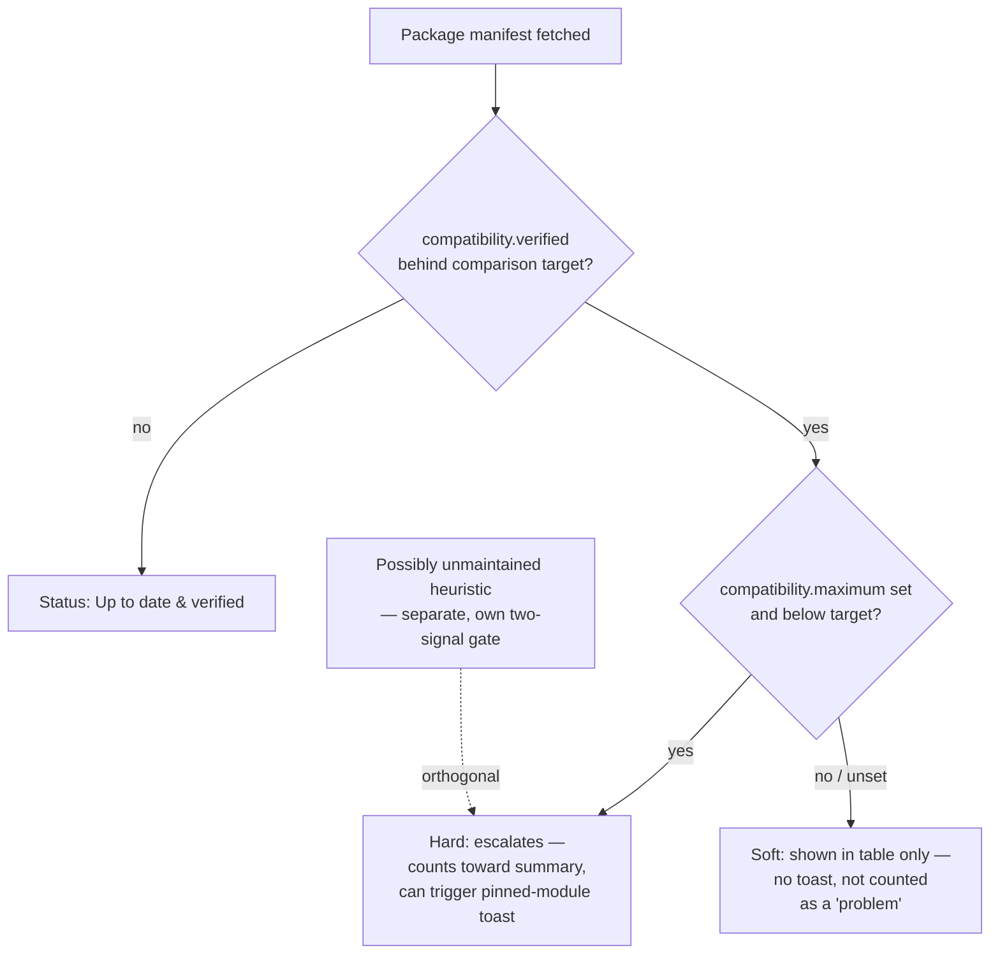

# ADR-0002: Scale compatibility severity to `compatibility.maximum`, not just a `verified` lag

## Context and Problem Statement

ADR-0001 gives the checker an automatic way to suspect a newer Foundry
generation exists: `inferredLatest`, the highest `compatibility.verified`
already declared across a GM's installed packages. Any package whose own
`verified` trails that inferred value gets flagged.

But `compatibility.verified` only ever means "the developer has explicitly
tested and bumped this field for this version." It does not mean "the
developer knows this breaks on anything newer." Bumping a manifest's
`verified` string is bookkeeping, separate from the actual work of testing
against a new core release — a package can run perfectly fine on a newer
Foundry version for months before its developer gets around to updating
the manifest. If the checker treats every `verified` lag as equivalent
evidence of a problem, two things go wrong: it's inaccurate (implying
functional risk that may not exist), and it's unkind to the volunteer
developers behind those packages (project rule 1) — nagging a GM about a
package that works fine is exactly the "dead"/"broken" framing this project
was built to avoid, even if the words used are softer.

Foundry's manifest schema already has a field for the case that *is* a real
developer claim: `compatibility.maximum`. It's a hard ceiling — Foundry's
own installer refuses to install a package above its declared `maximum`.
A developer who knows their code won't run past a certain core version sets
it explicitly. Its absence isn't silence; it's the ecosystem's own
convention for "no known incompatibility."

How should the checker's status/severity model use `maximum` to tell a real
developer-declared incompatibility apart from a manifest that's simply
behind on bookkeeping?

## Decision Drivers

* Kindness rule (project rule 1) — never imply a problem that may not
  exist; a checker that nags about fine packages erodes the trust it needs
  when it reports a real one
* Dev-declared, not tested (project rule 4) — only ever surface claims at
  the confidence level the developer actually declared them
* KISS — use manifest fields already being fetched; no new signal source,
  no new settings surface
* ADR-0001's `inferredLatest` is a floor, not proof — severity has to
  reflect that it's inference

## Considered Options

* Treat any `verified` lag (against the running or inferred version) as a
  single "problem" status, same severity regardless of `maximum`
* Use `compatibility.maximum` as a hard-signal gate: only escalate to an
  attention-worthy status when `maximum` is explicitly set and below the
  comparison target; a bare `verified` lag with `maximum` unset (or still
  ≥ target) stays low-key
* Suppress the "not yet verified" status entirely unless corroborated by
  the "possibly unmaintained" heuristic
* Add a GM-facing setting to choose how aggressively to flag version gaps

## Decision Outcome

Chosen option: "Use `compatibility.maximum` as a hard-signal gate,"
because it's the only option that lets the checker stay both useful and
honest without adding any new surface. It reuses a field already present
in every manifest fetch from the core v1 check (ADR-0001), needs no GM
configuration, and directly encodes the actual difference between "a
developer told us this won't work" and "nobody's touched this field
recently."

Concretely: a package's compatibility status carries one of two internal
severities, without adding new labels to the taxonomy in CLAUDE.md:

* **Hard** — `compatibility.maximum` is set and falls below the comparison
  target (`game.release` or `inferredLatest`). The developer has explicitly
  declared this won't work. This is the only tier that escalates: it counts
  toward the login chat summary's headline, and it's the only compatibility
  signal (alongside "possibly unmaintained") that can trigger the pinned
  critical-module `ui.notifications.warn` toast.
* **Soft** — `verified` trails the comparison target, but `maximum` is
  unset or still at/above it. Still shown as "Not yet verified for
  current/target Foundry version" in the checker table (the information is
  real and worth having available), but de-emphasized — not counted as a
  "problem" in the summary framing, never escalates a toast on its own.

The "possibly unmaintained" heuristic is unaffected — it already requires
its own two-signal corroboration (verified-lag *and* a frozen version or
archived repo) and continues to sit alongside this severity split as a
separate, orthogonal signal rather than being folded into it.

### Consequences

* Good, because it prevents false-alarm fatigue — a GM who ignores soft
  status because it's usually nothing won't also learn to ignore hard
  status, because the two look and behave differently.
* Good, because it makes ADR-0001's `inferredLatest` floor safe to ship: a
  single early-updating peer package can never, on its own, trigger a
  toast or headline problem count — it can only ever produce a soft status.
* Good, because it costs nothing new — `maximum` is already present in
  every manifest fetch the core v1 check makes.
* Bad, because some real incompatibilities will be under-classified as
  soft when a developer knew about the break but never bothered setting
  `maximum` (common in small hobby projects). Accepted as the right
  trade-off given project rule 1 — erring toward not nagging over erring
  toward alarming on unconfirmed claims.

### Confirmation

The login notification's `ui.notifications.warn` toast (v1 scope, item 4)
and the chat summary's headline "problem" count only fire for hard-tier
statuses and "possibly unmaintained" packages — never for a bare soft
status. Code review against this ADR should reject any change that
escalates notification severity purely from a `verified` lag without
checking `compatibility.maximum`.

## Pros and Cons of the Options

### Flat severity — any `verified` lag is a "problem"

* Good, because it's the simplest possible implementation.
* Bad, because it can't distinguish a real incompatibility from ordinary
  manifest staleness, which is the majority case for any actively-used
  package whose author just hasn't gotten to the bookkeeping yet.
* Bad, because it directly risks the kindness rule (project rule 1) by
  implying developers are behind on compatibility work they may have
  already effectively done.

### `compatibility.maximum` as a hard-signal gate (chosen)

* Good, because it reuses data already fetched — zero new cost.
* Good, because it maps directly onto what Foundry's own manifest schema
  already means by `maximum` versus `verified`.
* Neutral, because it produces two internal severities without adding new
  taxonomy labels — no changes needed to the status list in CLAUDE.md.
* Bad, because it under-flags real breakage when a developer never set
  `maximum` even knowing about it — see Consequences above.

### Suppress soft status unless corroborated by "possibly unmaintained"

* Good, because it would minimize false positives even further.
* Bad, because it throws away real, useful "heads up" information for GMs
  who want early awareness — the entire reason ADR-0001 built
  `inferredLatest` was to surface exactly this kind of early signal, and
  suppressing it entirely undercuts that decision.

### GM-configurable severity threshold

* Good, because it would let cautious and relaxed GMs each get the
  experience they want.
* Bad, because it's a new settings surface and a new decision for the GM
  to make before the checker is useful — more than v1's "ship the boring
  thing" scope calls for. Worth revisiting only if real usage shows the
  hard/soft split needs tuning.

## Architecture Diagram

## More Information

* [`ADR-0001`](ADR-0001-infer-newer-foundry-version-from-installed-packages.md) —
  the `inferredLatest` signal this severity model is protecting from
  over-triggering.
* [`CLAUDE.md`](../../CLAUDE.md) § "Core v1 scope" — the status taxonomy
  and pinned-module notification rules this decision refines without
  adding new labels.
* Project rule 1 (kindness to module developers) and rule 4 (dev-declared,
  not tested) — the two rules this decision most directly serves.
* Revisit if: real-world usage shows the hard/soft split needs GM-facing
  tuning (considered option 4), or if a future signal source lets us
  distinguish "developer knows about the break but didn't set `maximum`"
  from genuine staleness.
