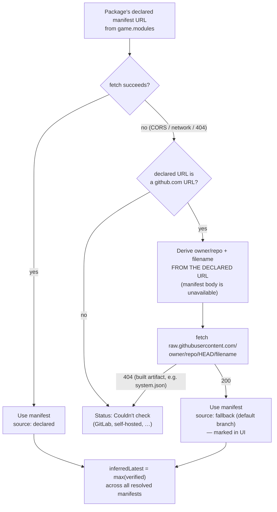

# ADR-0003: Fall back to `raw.githubusercontent.com` when a package's declared manifest URL is CORS-blocked

> ## ⚠️ Amended 2026-08-16 — fallback-sourced `version` is not trustworthy
>
> Live testing after implementation found the fallback reporting a **latest
> version older than the installed one**, producing a false "Up to date &
> verified". The decision below stands; what changes is **which fields of a
> fallback-sourced manifest may be used**:
>
> - **`compatibility.verified` — still used.** Measurably reliable.
> - **`version` — no longer used.** Treated as unknown; no "latest version"
>   figure and no update-available verdict for fallback-sourced rows.
>
> The Consequences section below still says the risk is that `HEAD` may be
> *ahead* of a release. That was half right: the risk is bidirectional, and
> the *behind* direction is the harmful one. See "Amendment" at the end.

## Context and Problem Statement

SPEC-0001's manifest check fetches every active package's declared
`manifest` URL from inside a running world. The first real-world test of
that check (Foundry v13.351, Starfinder world, five active third-party
modules plus the game system) returned `"Failed to fetch"` for **six of
seven packages**. Only one resolved.

The cause is CORS, and it is structural rather than incidental. The
dominant manifest-URL convention in the Foundry ecosystem is
`https://github.com/<owner>/<repo>/releases/latest/download/module.json`.
Requesting it produces a 302 → 302 → 200 chain ending at
`release-assets.githubusercontent.com`, and **no response in that chain
carries an `Access-Control-Allow-Origin` header**, so the browser rejects
it before this module ever sees a body. The single package that succeeded
happened to declare a `raw.githubusercontent.com` URL, which does return
`access-control-allow-origin: *`.

This is not the same wall ADR-0001 hit, but it is the same kind of wall one
layer down. ADR-0001 established that foundryvtt.com cannot be asked "what
is the latest core version" without a server or a license key, and routed
around it by inferring a target version from data the checker was *already
fetching*. That routing-around silently assumed the manifests themselves
were reachable. They mostly are not. With 6 of 7 rows reading "Couldn't
check," the checker reports almost nothing, and `inferredLatest` has too
little data to produce a peer signal at all — so ADR-0001's inference never
even gets to run.

Given that the declared URL is unreachable from a browser for most
packages, and that a proxy or credentials remain out of scope, where should
the checker get manifest data?

## Decision Drivers

* The capability is worth little if most rows say "Couldn't check" — this
  is the difference between a useful tool and a decorative one
* No server component, no API keys — a hard v1 constraint (project rule 5),
  and the specific failure mode that killed `arcanistzed/mcc`
* Dev-declared, not tested (project rule 4) — whatever is displayed must
  still be a real developer claim, and must not be presented as more
  authoritative than it is
* Kindness (project rule 1) — inaccurate data about a volunteer's package
  is worse than no data, so any fallback must not silently misreport
* KISS (project rule 2) — prefer the smallest mechanism that materially
  improves coverage
* ADR-0001's `inferredLatest` is downstream of this: it is computed from
  fetched manifests, so unreachable manifests disable it entirely
* Unauthenticated GitHub API rate limit (60/hr) is already partly spent on
  the "possibly unmaintained" archived check and must not be exhausted

## Considered Options

* Accept the CORS failures and report "Couldn't check"
* Derive a `raw.githubusercontent.com/<owner>/<repo>/HEAD/<file>` URL from
  the declared manifest URL and retry there on failure
* Use the GitHub API (`releases/latest`) to resolve the release tag, then
  fetch `raw.githubusercontent.com/<owner>/<repo>/<tag>/<file>`
* Build a proxy/relay service that fetches manifests server-side
* Ask GMs to supply a GitHub token to raise limits and unlock API paths

## Decision Outcome

Chosen option: **"Derive a `raw.githubusercontent.com/.../HEAD/<file>` URL
and retry there on failure."**

The fallback runs only when the declared URL fails, derives `<owner>/<repo>`
and the filename **from the declared manifest URL itself**, and refetches
from `raw.githubusercontent.com`. It adds at most one request per failing
package, needs no credentials, and consumes no GitHub API rate-limit
budget.

Two implementation details are load-bearing and are part of this decision,
not left to the implementer:

1. **The repo must be derived from the declared `manifest` URL, not from
   the fetched manifest's `url`/`bugs` fields.** Those fields live *inside*
   the manifest body, which is precisely what is unavailable when the fetch
   failed. The declared URL — already known locally from `game.modules` —
   contains `<owner>/<repo>` and is therefore the only viable source.
2. **The filename must be carried over from the declared URL, not
   hardcoded to `module.json`.** Game systems declare `system.json`;
   hardcoding would break every system, including the one this was first
   tested against.

Measured against the seven packages in the real test world:

| Package | Declared URL host | Fallback result |
|---|---|---|
| `multilevel-tokens` | `raw.githubusercontent.com` | already succeeded, untouched |
| `lib-wrapper` | GitHub release asset | recovered — `version 1.13.5.1`, `verified 14` |
| `smarttarget` | GitHub release asset | recovered — `version 0.5.1`, `verified 14` |
| `the-plugin-plugin` | GitHub release asset | recovered — `version 0.1.0`, `verified 13` |
| `sfrpg` (system) | GitHub release asset | still fails (404 — `system.json` is built into `dist/`, absent from the repo root) |
| `pings` | GitLab job artifact | still fails (not GitHub; no equivalent raw path) |
| `settings-extender` | GitLab job artifact | still fails (same) |

Coverage moves from **1/7 to 4/7**. That is a partial fix, deliberately
adopted as such.

The most consequential downstream effect: `lib-wrapper` and `smarttarget`
both declare `compatibility.verified: 14` while the test world runs
13.351. Under the current behavior neither manifest is readable, so
`inferredLatest` resolves to `null` and reports "no peer signal." With this
fallback, `inferredLatest` resolves to **14** and ADR-0001's inference
produces a correct, useful target-version signal for the first time —
independently corroborated by the Foundry server log announcing
`Core software stable update 14.366 is available!`. ADR-0001's mechanism
was never wrong; it was starved of input.

### Consequences

* Good, because it roughly quadruples usable coverage on a real modlist
  with no server, no credentials, and no new dependency.
* Good, because it makes ADR-0001's `inferredLatest` actually functional
  rather than permanently degraded to "no peer signal."
* Good, because it costs nothing for packages whose declared URL already
  works — the fallback is reached only on failure, so well-behaved
  packages incur exactly one request as before.
* Good, because it spends no GitHub API rate limit, leaving the 60/hr
  budget intact for the "possibly unmaintained" archived check.
* Bad, because `HEAD` is the default branch, not the released tag. A
  repository whose default branch is ahead of its latest release will
  report a `version` that is not yet downloadable, and a
  `compatibility.verified` that no released build actually carries. This
  is a real accuracy regression against the released-manifest ideal and is
  mitigated, not eliminated, by labeling (see Confirmation).
* Bad, because coverage remains incomplete and unevenly distributed:
  packages that build their manifest into a release artifact (common for
  game systems) and packages hosted anywhere other than GitHub gain
  nothing. GitLab-hosted packages in particular have no equivalent path —
  the repo-root raw URL 404s when the manifest is a build product, and job
  artifacts are CORS-blocked.
* Bad, because it hardcodes knowledge of one forge's URL layout into the
  fetch path, which is exactly the kind of coupling that rots when the
  forge changes its conventions.
* Neutral, because it can be superseded later by the GitHub API tag
  approach without changing anything the GM sees, should the accuracy
  trade-off prove unacceptable in practice.

### Confirmation

A result obtained via the fallback MUST be distinguishable from one
obtained via the package's own declared URL, both in the data model and to
the GM. Because `HEAD` may be ahead of any release, presenting a
fallback-sourced version as "the latest published version" would violate
project rule 4 (dev-declared, not tested) by overstating what the developer
actually shipped — and, under project rule 1, could imply a volunteer is
behind on a release they never made.

Code review against this ADR should reject:

* any implementation that queries `raw.githubusercontent.com` *before*
  trying the package's own declared URL;
* any implementation that derives `<owner>/<repo>` from the fetched
  manifest body rather than the declared manifest URL;
* any implementation that hardcodes `module.json` rather than carrying the
  filename over from the declared URL;
* any UI that presents fallback-sourced data without marking its
  provenance.

## Pros and Cons of the Options

### Accept the CORS failures and report "Couldn't check"

* Good, because it is perfectly honest — the checker never claims anything
  it did not verify.
* Good, because it adds no code, no coupling, and no new failure modes.
* Bad, because measured real-world coverage is 1/7. A checker that cannot
  check is not worth installing, and a GM who sees six "Couldn't check"
  rows learns nothing and stops opening the window.
* Bad, because it leaves ADR-0001's `inferredLatest` permanently starved,
  quietly nullifying a decision this project already made and built.

### `raw.githubusercontent.com/.../HEAD/<file>` fallback (chosen)

* Good, because it is CORS-open (`access-control-allow-origin: *`,
  verified directly), needs no auth, and has no documented rate limit for
  this usage pattern.
* Good, because the required inputs are already on hand — the declared
  manifest URL is local data from `game.modules`.
* Good, because it degrades to today's behavior when it misses: a 404
  simply yields the same "Couldn't check" the package would have had
  anyway.
* Neutral, because it improves coverage substantially without completing
  it — 4/7 rather than 7/7.
* Bad, because default-branch state is not release state, so reported
  versions can describe unreleased work.
* Bad, because it only helps GitHub-hosted packages whose manifest is
  committed at the repo root.

### GitHub API `releases/latest` → tag → `raw@tag`

* Good, because it returns the exact *released* manifest, eliminating the
  unreleased-work skew that is the chosen option's main flaw.
* Good, because `api.github.com` is CORS-open (verified), and this project
  already calls it for the archived check, so no new trust boundary.
* Bad, because it costs two extra requests per failing package instead of
  one, and every one of them draws down the same unauthenticated 60/hr
  limit the "possibly unmaintained" heuristic depends on. A GM with a large
  modlist could exhaust the budget and degrade *both* features at once.
* Bad, because rate-limit exhaustion fails in a confusing, time-dependent
  way — the same modlist checks fine in the morning and mysteriously
  reports "Couldn't check" an hour later, which is far harder to reason
  about than a consistent miss.
* Neutral, because it remains available as a targeted upgrade for packages
  where release-accuracy matters most, if the HEAD skew proves harmful.

### Proxy/relay service

* Good, because a server has no CORS restrictions and would fetch every
  manifest regardless of host, solving GitLab and build-artifact cases too.
* Bad, because it is explicitly out of scope (project rule 5) and is
  precisely the architecture that killed `arcanistzed/mcc` — standing
  infrastructure a volunteer must maintain forever, with no handoff path.
* Bad, because it reintroduces the single point of failure this project was
  designed to avoid.

### Ask GMs for a GitHub token

* Good, because it would raise the API limit from 60/hr to 5,000/hr and
  make the tag-resolution approach comfortably affordable.
* Bad, because it is an API key by any reasonable definition and is
  explicitly out of scope, for the same reasons ADR-0001 rejected
  collecting a Foundry license key.
* Bad, because asking GMs to hand a third-party module a credential is a
  genuine security and privacy problem independent of project rules.

## Architecture Diagram



The diagram's load-bearing edge is `F`: the derivation reads the *declared*
URL, because the manifest body — the usual source of `url`/`bugs` — is by
definition unavailable on the path where the fallback is needed.

## More Information

* [`ADR-0001`](ADR-0001-infer-newer-foundry-version-from-installed-packages.md)
  — this decision extends it. ADR-0001 routed around CORS at
  foundryvtt.com by inferring a target version from already-fetched
  manifests; this decision addresses the unexamined assumption in that
  reasoning, namely that those manifests are themselves fetchable.
* [`ADR-0002`](ADR-0002-severity-by-declared-maximum-not-just-verified-lag.md)
  — severity classification is downstream of this: `compatibility.maximum`
  cannot gate anything for a manifest that never loaded.
* [`SPEC-0001`](../openspec/specs/compatibility-checker/spec.md) REQ
  "Manifest Check" and REQ "Error Handling Standards" — the fallback is an
  additional attempt *within* the existing per-package error isolation, and
  must not weaken it; a package that exhausts both attempts still resolves
  to "Couldn't check" rather than throwing.
* Evidence for this decision was gathered by running the module in a real
  Foundry v13.351 world rather than against test doubles. The CORS
  behaviour, the header comparison, and the 4/7 coverage figure are all
  measured, not assumed.
* Revisit if: GitHub begins sending CORS headers on release assets (the
  fallback becomes unnecessary); the Foundry ecosystem converges on a
  CORS-open manifest convention; or observed HEAD-vs-release skew proves
  harmful enough to justify paying the API rate-limit cost for tag
  resolution.

## Amendment — 2026-08-16

### What live testing found

The fallback shipped, and the first real scan surfaced this row:

| `theripper93/Smart-Target` | |
|---|---|
| Installed | **0.9.8** |
| Reported "Latest" (via fallback) | **0.5.1** |
| **Actual latest release** | **4.0.0** |
| Status shown to the GM | **"Up to date & verified"** |

Two things are wrong. A "latest" older than "installed" is visibly
incoherent. Worse, the GM is told they are current while sitting three
major versions behind — a **false negative**, in a tool whose entire
purpose is telling GMs what is out of date. Of the two ways to be wrong,
this is the damaging one: an over-alarm gets checked, a false all-clear
does not.

The original Consequences section anticipated skew in one direction only —
"a repository whose default branch is ahead of its latest release will
report a version that is not yet downloadable". The skew is
**bidirectional**, and the unexamined direction is the one that hurts.

### Root cause: the two fields have different reliability

The same fallback file yields one trustworthy field and one untrustworthy
one, and there is a mechanical reason. Fetching Smart-Target's *released*
manifest and its *committed* manifest side by side:

```
RELEASED  (releases/latest/download/module.json): version=4.0.0  verified=14
COMMITTED (raw.githubusercontent.com/HEAD)      : version=0.5.1  verified=14
```

`version` differs by three major versions. `verified` is **identical**.

The reason: **`version` is stamped by CI at release time**, so the value
committed to the default branch is whatever placeholder was last written by
hand — frequently stale, and never load-bearing for the maintainer.
**`compatibility.verified` is hand-edited metadata that lives in the
committed file**, which is exactly why a developer updates it there. This
project's own release workflow does the same thing: `release.yml` stamps
`.version` into `module.json` at tag time.

So the fallback's usefulness was never uniform across fields, and the
original decision treated the manifest as a single trustworthy unit.

Sampled across repositories that publish releases: `lib-wrapper`
(`1.13.5.1` committed vs `v1.13.5.1` released) and `multilevel-tokens`
(`1.7.0` vs `v1.7.0`) both match, while `Smart-Target` does not. A small
sample, and deliberately not presented as a rate — the point is that a
maintainer's release tooling is **unknowable from the manifest**, so no
per-package prediction is possible.

### Revised decision

A fallback-sourced manifest is no longer treated as a whole. Field by
field:

* **`compatibility.verified` (and legacy `compatibleCoreVersion`) — used.**
  Reliable, and it is what feeds severity classification (ADR-0002), the
  comparison target's peer-inference fallback (ADR-0001), and the
  verified-check precondition for the unmaintained heuristic (ADR-0004).
  This is the bulk of the fallback's value and it is retained intact.
* **`version` — not used.** For a fallback-sourced result the system MUST
  treat the latest version as **unknown**: no "latest version" figure
  surfaced, and no update-available verdict derived. Unknown is reported as
  unknown, never as "up to date".
* **`url` / `bugs` / `changelog` — used.** Link-out targets are not
  version-sensitive; a stale committed URL still points at the right
  project.

Declared-URL results are unaffected. Their `version` *is* the released
version, which is the whole reason the declared URL remains primary.

### Consequences of the amendment

* Good, because it removes the only failure mode that could tell a GM they
  are current when they are not — the class of error this project can least
  afford.
* Good, because it costs nothing: no extra request, no rate-limit spend, no
  new dependency. It is a narrowing of what is trusted, not new machinery.
* Good, because it keeps the compatibility signal, which was the larger
  half of ADR-0003's value and is measurably sound.
* Good, because "unknown" is already a first-class outcome throughout this
  project (ADR-0001's no-peer-signal, ADR-0004's unknown activity, the
  "Couldn't check" status), so it needs no new vocabulary.
* Bad, because update availability is lost for every fallback-sourced
  package — 3 of 7 in the tested world. A GM will see compatibility
  information but no "update available" for those rows, which is a real
  reduction in what the checker reports.
* Bad, because a package whose committed `version` *is* accurate is
  penalised alongside the ones that are not. There is no way to tell them
  apart without the API call this ADR declined to make.
* Neutral, because the GitHub API tag-resolution option remains available
  as a targeted upgrade if the lost update-availability proves more painful
  than the rate-limit cost. That trade-off is unchanged; only the reason to
  reach for it has become clearer.

### Confirmation

Code review against this amendment should reject:

* any surfacing of a fallback-sourced `version` as the latest or published
  version;
* any update-available verdict computed from a fallback-sourced `version`,
  including one guarded by a plausibility check such as "only if newer than
  installed" — a stale placeholder that happens to be higher passes that
  guard and reports wrongly, so plausibility is not evidence;
* any presentation that renders unknown update availability as "up to date"
  rather than as unknown.

A regression test MUST cover the observed case directly: a fallback-sourced
manifest whose `version` is **older** than the installed version MUST NOT
produce an "up to date" verdict, and MUST NOT surface that version as the
latest.

### Follow-up required

SPEC-0002 REQ "Result Provenance" currently requires only that
fallback-sourced data be *distinguishable*, which is not sufficient — the
Smart-Target row was correctly marked "Read from the repository's default
branch, not a published release" and was still wrong. The requirement needs
to state which fields may be used, not merely how they are labelled.

Two smaller items observed at the same time, for the same amendment:

* The checker table's **"Latest" column header** asserts more than
  fallback-sourced data supports. With `version` no longer surfaced for
  those rows the cell is empty, which resolves the immediate conflict, but
  the header wording is worth revisiting.
* The provenance note renders as **text without an `aria-label` or
  `title`**. It is not colour-only, so it does not violate SPEC-0002's
  accessibility requirement outright, but the requirement asks for a text
  alternative naming the source specifically.
