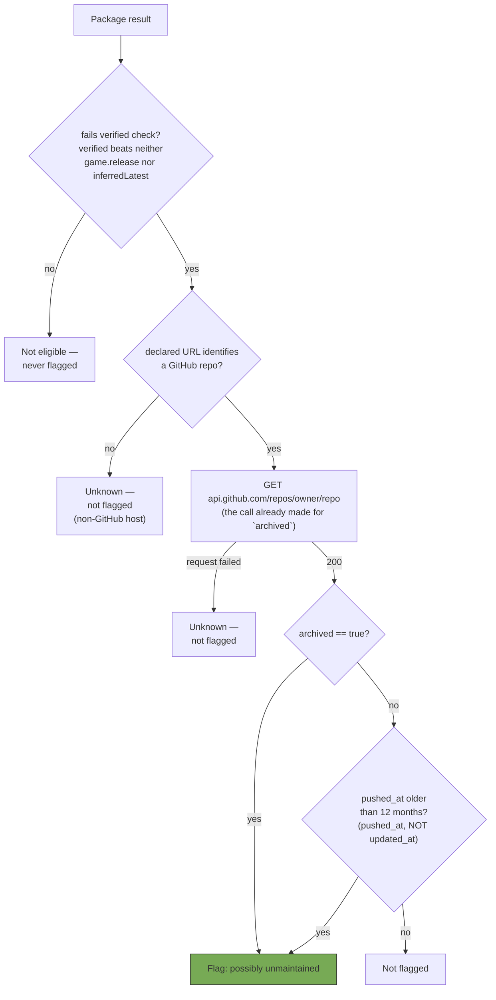

# ADR-0004: Bound the "possibly unmaintained" signal by repository activity age, not by an unchanged version

## Context and Problem Statement

SPEC-0001 REQ "Possibly Unmaintained Heuristic" flags a package when it
fails the verified-compatibility check **and** either its manifest
`version` has not changed "across checks" **or** its GitHub repository is
archived.

The first real-world run of the checker exposed a defect in that first
signal. `multilevel-tokens` was flagged "possibly unmaintained" with
`githubArchived: false` — the flag fired entirely on the frozen-version
signal, because two scans roughly **four minutes apart** naturally observed
the same published version. The requirement never bounds how far apart
"checks" are, so this is spec-compliant behavior: `isVersionFrozen` is a
faithful implementation of what the spec says. The spec is the defect, not
the code.

The failure is subtler than "it flagged a good package," and the subtlety
is what makes it worth an ADR rather than a patch. `multilevel-tokens` had
in fact not shipped a release since **2024-06-07 — about 26 months** — so
the label was arguably *correct*. It was reached by invalid reasoning that
happened to land on the right answer. The genuinely dangerous case is the
inverse: a package released last month whose author simply has not gotten
around to bumping `compatibility.verified`. That package fails the verified
check, shows an unchanged version between any two scans in a sitting, and
gets labeled "possibly unmaintained" — which is precisely the
bookkeeping-lag-is-not-abandonment harm ADR-0002 was written to prevent,
leaking into the one heuristic ADR-0002 explicitly left alone.

So: what evidence should stand in for "this package may not be maintained,"
given that "we saw the same version twice" carries no information about
elapsed time?

## Decision Drivers

* Kindness (project rule 1) — a false accusation of abandonment against a
  volunteer's project is the specific harm this project exists to avoid,
  and it is worse than staying silent
* Signal integrity — a label that fires on nearly every lagging package
  trains GMs to ignore it, so the genuinely-dormant case it exists for gets
  lost along with the false ones
* Dev-declared, not tested (project rule 4) — the evidence used should be a
  real observable fact about the project, not an artifact of when the GM
  happened to open a window
* KISS (project rule 2) — prefer a mechanism with no new persistence, no
  new network calls, and no migration
* Unauthenticated GitHub API rate limit (60/hr) is already partly spent on
  the archived check and must not be increased
* ADR-0002's principle: escalate on what a developer actually declared or
  did, not on inference from absence

## Considered Options

* Keep the unbounded frozen-version signal (status quo)
* Add an elapsed-time floor to the frozen-version signal, persisting a
  timestamp alongside each stored version
* Replace the frozen-version signal with repository activity age, read from
  the GitHub API response the archived check already fetches
* Drop the frozen-version signal entirely and require `archived` alone
* Require both signals (change the OR to an AND)

## Decision Outcome

Chosen option: **"Replace the frozen-version signal with repository
activity age, read from the response the archived check already fetches,"**
with the threshold set at **12 months**.

`checkGithubArchived` already issues `GET
https://api.github.com/repos/{owner}/{repo}` and reads `archived` from the
result. That same response body carries `pushed_at`. The module is already
downloading the evidence it needs and discarding it. Reading `pushed_at`
from the response in hand costs **zero additional requests**, zero
additional rate-limit budget, and no stored state.

The heuristic becomes: flag a package when it fails the verified check
**and** either its repository is archived, **or** its repository has had no
pushed activity for at least 12 months.

Two specifics are part of this decision rather than left to implementation:

1. **The field is `pushed_at`, not `updated_at`.** They are near-synonyms
   in name and wildly different in meaning: `pushed_at` moves on commits,
   while `updated_at` moves on metadata changes such as stars or a
   description edit. For `multilevel-tokens` the two read `2024-06-22` and
   `2026-05-15` respectively — choosing `updated_at` would make a
   26-month-dormant repository look three months fresh and silently defeat
   the entire signal.
2. **Unknown remains unknown.** A non-GitHub package, or a GitHub API
   failure, yields no activity signal, and MUST be treated as "unknown"
   rather than as evidence in either direction — identical to the existing
   handling of `archived`.

12 months separates the observed cases cleanly. In the test world the
maintained packages had pushed within 1.5–4.5 months (`sfrpg` 2026-07-02,
`lib-wrapper` 2026-05-03, `Smart-Target` 2026-04-02) while the dormant one
sat at 26 months. Foundry generations arrive roughly annually, so 12 months
means a package has sat through an entire release cycle untouched. Erring
long is the kind direction, per project rule 1.

### Consequences

* Good, because it eliminates the reported false positive outright: elapsed
  time between two scans in one sitting is no longer evidence of anything.
* Good, because it costs nothing — no new request, no rate-limit spend, no
  persisted state, and no migration.
* Good, because it works on the **first** check a world ever performs. The
  frozen-version signal structurally could not: it needed a prior baseline,
  so a fresh install learned nothing until its second check, and then
  learned something false.
* Good, because it measures a real property of the project (nobody has
  pushed in a year) rather than an artifact of the observer's behavior
  (we looked twice).
* Good, because it makes the `previousPackageVersions` world setting dead
  code. That setting exists solely to feed `isVersionFrozen` — confirmed by
  inspection — so this decision retires a persisted world setting rather
  than growing one. See Confirmation for the removal constraint.
* Bad, because the signal now covers only GitHub-hosted packages. The
  frozen-version comparison was host-agnostic in principle. In practice it
  was also worthless, so this trades a broad wrong signal for a narrow
  right one — but packages on GitLab and elsewhere now yield "unknown"
  permanently, and can never be flagged.
* Bad, because `pushed_at` counts any push, including CI tweaks, typo
  fixes, and dependency bumps that do not represent real maintenance. A
  dormant project with an occasional housekeeping commit will read as
  active. This biases toward *not* labelling, which is the correct
  direction to be wrong in, but it does blunt the heuristic.
* Bad, because 12 months is a judgment call, not a derived constant. It is
  grounded in a four-package sample and the annual Foundry cadence, which
  is thin evidence for a threshold that decides whether a volunteer's work
  gets publicly labeled.
* Neutral, because the heuristic remains conservative overall: it still
  requires the verified-check failure as a precondition, so activity age
  alone can never flag a package that is otherwise current.

### Confirmation

The heuristic MUST NOT flag any package on evidence that varies with when
or how often the GM ran a check. A regression test MUST cover the reported
case directly: two checks in quick succession against a non-archived,
recently-pushed package that fails the verified check MUST NOT produce the
flag.

Code review against this ADR should reject:

* any implementation that reads `updated_at` where `pushed_at` is
  specified;
* any implementation that issues a second GitHub API request to obtain
  activity data already present in the archived-check response;
* any implementation that treats a non-GitHub package, or a failed API
  call, as evidence *toward* "possibly unmaintained";
* any implementation that flags on activity age without also requiring the
  verified-check failure.

Removal of the now-orphaned `previousPackageVersions` setting MUST
unregister it rather than silently leaving it registered and unread.
Foundry retains orphaned values in the world database, so the removal
should be treated as a deliberate cleanup with a note in the changelog, not
an invisible deletion.

## Pros and Cons of the Options

### Keep the unbounded frozen-version signal (status quo)

* Good, because it is host-agnostic — it works for GitLab and self-hosted
  packages, which the chosen option cannot.
* Bad, because it is measurably wrong: it fires on the second check of any
  session regardless of real staleness, as observed in live testing.
* Bad, because it risks exactly the accusation project rule 1 forbids,
  against precisely the developers ADR-0002 was written to protect.

### Elapsed-time floor on a persisted version baseline

* Good, because it keeps the signal host-agnostic while fixing the timing
  defect.
* Good, because it measures our own observation history, so it needs no
  third-party service.
* Bad, because it requires changing the shape of a live world setting from
  `{id: version}` to something carrying timestamps, with a migration path
  for existing worlds — real complexity for a signal that will be strictly
  worse than reading the repository's own history.
* Bad, because it cannot fire until a baseline has aged past the threshold.
  A fresh install would learn nothing about dormancy for a full year, which
  is most of the value gone.
* Bad, because "we first saw this version N months ago" is a weaker proxy
  for maintenance than "nobody has pushed in N months" — it says more about
  when the GM installed the module than about the project.

### Repository activity age from the existing API response (chosen)

* Good, because the data is already being fetched and thrown away — the
  marginal cost is a property read.
* Good, because it is a direct observation of the project rather than a
  proxy, and is available immediately on first check.
* Good, because it retires persisted state instead of adding it.
* Bad, because it is GitHub-only and permanently silent elsewhere.
* Bad, because `pushed_at` overstates activity for repositories receiving
  housekeeping commits.

### Drop the frozen signal; require `archived` alone

* Good, because it is the simplest possible fix and has no false positives
  at all — an archived repository is an explicit, unambiguous declaration.
* Good, because `archived` behaved correctly in live testing, returning an
  accurate `false`.
* Bad, because most dormant projects are never archived — archiving is a
  deliberate act many maintainers never perform. The heuristic would fire
  so rarely that its existence becomes hard to justify, and the "possibly
  unmaintained" status label would be near-dead code.

### Require both signals (AND instead of OR)

* Good, because it would be the most conservative option available.
* Bad, because it inherits the frozen-version signal's timing defect while
  adding a second condition, so it fixes nothing about the actual bug — it
  only makes the broken signal harder to trigger.
* Bad, because requiring an archived repo *and* dormancy is nearly
  equivalent to requiring `archived` alone, since archived repositories are
  dormant by definition.

## Architecture Diagram

The single API call at `F` supplies both branches. No second request is
issued, and no value is persisted between checks — the removed
frozen-version path is what required stored state.

## More Information

* [`ADR-0002`](ADR-0002-severity-by-declared-maximum-not-just-verified-lag.md)
  — this decision extends it. ADR-0002 established that a bare
  `compatibility.verified` lag is bookkeeping rather than breakage, and
  deliberately left the unmaintained heuristic as an orthogonal signal.
  Live testing showed the heuristic had its own route to the same harm, so
  the principle is applied here too.
* [`SPEC-0001`](../openspec/specs/compatibility-checker/spec.md) REQ
  "Possibly Unmaintained Heuristic" — the requirement this decision amends.
  Its second bullet ("Across checks, the package's fetched manifest
  `version` has not changed") is replaced by the activity-age condition.
* Issue #22 — the defect report, including the captured signal values
  (`versionFrozen: true`, `githubArchived: false`) from the live world.
* [`ADR-0003`](ADR-0003-raw-github-fallback-for-cors-blocked-manifests.md)
  — relevant context rather than a dependency: once the manifest fallback
  lands, more packages will resolve successfully and therefore become
  *eligible* for this heuristic, which raises the cost of getting it wrong.
* Evidence was gathered from a live Foundry v13.351 world and the public
  GitHub API on 2026-08-15: `multilevel-tokens` `pushed_at` 2024-06-22 vs
  `updated_at` 2026-05-15; `lib-wrapper` 2026-05-03; `Smart-Target`
  2026-04-02; `sfrpg` 2026-07-02.
* Revisit if: the 12-month threshold proves wrong in practice (either
  flagging active projects or staying silent on obviously dead ones); a
  credential-free way appears to measure release cadence rather than raw
  push activity; or non-GitHub hosting becomes common enough in the Foundry
  ecosystem that a permanently-silent signal for those packages is no
  longer acceptable.
