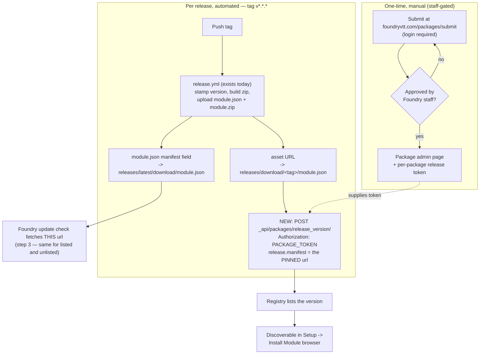

# ADR-0005: Distribute via the official Foundry package registry, publishing releases from CI

## Context and Problem Statement

The module is currently installable only by pasting a manifest URL into
Foundry's **Install Module** dialog. That works, but it means a GM has to
already know the module exists and have the URL to hand.

Foundry has no in-world package search. Discovery happens on the Setup
screen's Install Module browser, which is backed by the official package
listing on foundryvtt.com. Appearing there is not something code can
achieve: it requires submitting the package and passing a manual review by
Foundry staff. The community wiki puts the payoff plainly — publishing a
Foundry release "puts your module into the searchable Foundry ecosystem,
letting it be found and installed by users in Setup."

There is a second, less obvious dimension. This module's entire purpose is
reading package manifests to determine update availability. Whether a
package is registry-listed changes how Foundry itself resolves "latest
version," so the distribution decision is entangled with our own fetch
design and with ADR-0003. That question is resolved below rather than left
implicit.

So: should the-plugin-plugin be submitted to the official registry and have
its releases published there from CI, or should it remain manifest-URL-only?

## Source verification

The research that prompted this ADR was gathered from secondary sources
(community wiki, League of Foundry Developers template, third-party release
actions) because foundryvtt.com and foundryvtt.wiki were blocked by an
egress proxy in that session.

**Those domains were reachable while writing this ADR**, so each claim was
re-checked against the primary articles. The results are mixed and are
recorded here rather than smoothed over, because several load-bearing
claims did not survive.

| Claim | Status |
|---|---|
| Endpoint `POST https://foundryvtt.com/_api/packages/release_version/` | **Verified** — package-release-api |
| Per-package token, `fvttp_` prefix, from the "Package Release Token" field above "Save Package"; revocable via a Refresh button | **Verified** — package-release-api |
| Body `{id, dry-run, release:{version, manifest, notes, compatibility:{minimum, verified, maximum}}}` | **Verified** — package-release-api |
| `id` is "ID of your package, as listed in your package manifest" | **Verified** — package-release-api |
| The **released** manifest URL must be version-pinned | **Verified**, with a correction — see below |
| Submission is behind an account login | **Verified empirically** — both `/packages/submit` and `/creators/submit/` return a login wall |
| Manual staff review before listing | **Verified** — publisher-handbook ("If it hasn't been approved it won't be available for installation just yet"); wiki ("submit it to Foundry for review and potential listing") |
| Review turnaround "typically a few days" | **Not verified** — no turnaround time stated in any primary source consulted |
| An *active Foundry license* is required on the submitting account | **Not verified** — only that an account login is required. Do not assert this |
| Package Name form field must exactly match manifest `id`, and is globally unique | **Not verified as stated.** The release API is keyed on the manifest `id`, which implies the registry record is too, but no primary source consulted states the form-field rule or global uniqueness explicitly. Treated as likely-but-unconfirmed |
| Listing metadata (description, tags, cover art) — not `module.json` — is what the in-app browser searches and filters on | **Not verified** — not described in any primary source consulted. Plausible, but the ADR does not rely on it |

**The correction that matters most:** the secondary research said the
registered manifest URL "must be version-pinned, never
`/releases/latest/download/`." That is right for the URL submitted *to the
release API*, and wrong if read as applying to `module.json`. The primary
article is explicit that these are two different URLs:

> "This is not the package manifest URL in your package manifest, which
> should be pointed to a `latest` branch. Instead, it should point to a
> **specific** release to allow users to download this specific version of
> your package."

The wiki agrees about the `module.json` side: the `latest` URL is "the URL
that Foundry checks to see if a newer version of your module is available."
Our `module.json` already points `manifest` at
`releases/latest/download/module.json` and **must keep doing so** — reading
the correction the other way would have broken update detection for every
existing installation.

## The open question, resolved: how listing changes update resolution

**Question:** once a package is listed, does Foundry resolve "latest
version" through the foundryvtt.com package API instead of each package's
own `manifest` field?

**Answer: no — listing adds a step in front of the manifest fetch, it does
not replace it.** The package-management article gives the update flow
verbatim:

> 1. User initiates the flow by either clicking on "Check Update" an
>    individual module or the "Update All" button.
> 2. **If the Package is listed in the Package Repository:** 2.a Foundry
>    checks to see if the `manifest` field has changed in the listing and
>    points to a newer version compatible with the installed version of
>    Foundry. 2.b If so, Foundry prompts the User to see if they want to use
>    the old local value, or the new Package Repository value (recommended)
>    2.c If the User selects "Yes", the local manifest is overwritten with
>    the new value from the Package Repository
> 3. Foundry fetches the manifest from the url in the currently installed
>    package's manifest json.
> 4. Foundry compares the `version` strings of the installed module's
>    manifest against the fetched manifest.

Step 3 runs for listed and unlisted packages alike. Listed packages get
steps 2.a–2.c first, which can **rewrite the installed package's `manifest`
URL** (with user consent) before that fetch.

### What this means for our fetch strategy

**The good news, and it is the load-bearing part:** our manifest-fetcher
reads each package's installed `manifest` field from `game.modules` and
fetches it — which is exactly Foundry's step 3, for every package
regardless of listing status. SPEC-0001 REQ "Manifest Check" and ADR-0003's
premise both hold. Listing this module does not invalidate the approach,
and neither does any other package being listed.

Two consequences do follow, and both are recorded as risks rather than
resolved here:

1. **Sidegrading can change installed metadata without a version change.**
   The same article: "If a remote manifest and/or the website does not offer
   a new version, but does offer new metadata, the local installed version
   of that Package gets sidegraded with the new values." So the
   `compatibility` values we read from `game.modules` may originate from the
   website listing rather than from the `module.json` that actually shipped.
   Our comparisons use the *fetched* manifest for the "latest" side, so this
   mostly affects the installed side, but it means installed metadata is not
   a reliable record of what a release contained.

2. **A listed package's local manifest URL may become version-pinned.**
   This one is *inferred*, not stated: step 2.c writes "the new value from
   the Package Repository" into the local manifest, and the repository's
   per-version manifest URL is required to be version-pinned. If that
   inference holds, then for such a package our fetch would retrieve the
   manifest for the installed version and compare it against itself —
   reporting "up to date" indefinitely. **This is not confirmed and must not
   be treated as fact.** It is worth noting that ADR-0003's
   `raw.githubusercontent.com/<owner>/<repo>/HEAD/<file>` fallback is
   immune, since `HEAD` is never version-pinned — so if the risk proves
   real, the fallback is part of the mitigation rather than a casualty.

Neither consequence argues against listing. Both are properties of the
Foundry ecosystem our module already operates in.

## Decision Drivers

* Discovery is the point — a compatibility checker nobody can find does not
  help the GMs it was written for
* KISS (project rule 2) — prefer an off-the-shelf action or a plain `curl`
  step over anything bespoke
* The existing release workflow already produces the artifacts a listing
  needs; a decision that requires rebuilding it is more expensive than it
  looks
* Kindness (project rule 1) applies reflexively here: this module flags
  packages whose `compatibility.verified` lags. Shipping it with stale
  compatibility metadata would make it fail its own check
* No new standing infrastructure — the failure mode that killed
  `arcanistzed/mcc` (see `docs/research/mcc-research.md`)
* Anything requiring a credential deserves scrutiny, per the reasoning in
  ADR-0001 about license keys

## Considered Options

* Stay manifest-URL-only
* Submit for listing, publish each version manually from the package admin
  page
* Submit for listing, publish versions from CI via the Package Release API
  using an off-the-shelf action or a `curl` step
* Submit for listing, build bespoke publishing tooling

## Decision Outcome

Chosen option: **"Submit for listing, publish versions from CI via the
Package Release API using an off-the-shelf action or a `curl` step."**

Submission is a one-time manual act gated on staff review. Once approved,
version publishing becomes a step appended to the existing tag-triggered
release workflow.

The repository is already most of the way there. `.github/workflows/release.yml`
triggers on `v*.*.*` tags, stamps the version into `module.json`, and
uploads both `module.json` and `module.zip` as release assets — so the
version-pinned manifest URL the release API requires **already exists**:

```
https://github.com/jonstump/the-plugin-plugin/releases/download/<tag>/module.json
```

What is missing is a publish step calling the release API, and a
`PACKAGE_TOKEN` repository secret holding the per-package token.

Three specifics are part of this decision rather than left to
implementation:

1. **Submit the version-pinned asset URL, keep `module.json`'s `manifest`
   pointing at `latest`.** These are different URLs serving different
   purposes, and conflating them is the single easiest way to break this
   (see Source verification above).
2. **Whatever `compatibility` is in `module.json` at release time becomes
   the registered compatibility for that version.** It currently reads
   `minimum: "13"`, `verified: "13"`. Foundry hard-enforces `minimum` and
   `maximum` — a package marked `maximum: 12` "can only be installed and
   enabled on a Version 12 build" — so an incorrect ceiling makes the module
   uninstallable rather than merely mislabeled. Leaving `maximum` unset
   remains correct.
3. **Keeping `verified` current is not cosmetic for this module
   specifically.** It ships a checker that flags packages whose `verified`
   lags the current Foundry generation. If our own `verified` goes stale,
   the module flags itself — and more to the point, it would be asking
   volunteers to keep metadata current while not doing so.

Use `dry-run` before the real call. The API returns
`"Dry run completed successfully. To save, submit the request again without
dry-run"`, which makes a safe rehearsal cheap.

### Consequences

* Good, because the module becomes findable in the Setup-screen browser,
  which is the only discovery surface Foundry offers — the gap this decision
  exists to close.
* Good, because it costs no new infrastructure: no server, no hosted
  service, nothing that can rot the way mcc's worker did. The registry is
  operated by Foundry, and GitHub releases remain the actual artifact host.
* Good, because it claims the `the-plugin-plugin` id in the registry.
  Whether the namespace is *globally* unique is unconfirmed (see Source
  verification), but the release API is keyed on the manifest `id`, so
  registering establishes our claim to it either way.
* Good, because the existing workflow already emits the required
  version-pinned manifest asset — the change is additive, not a rebuild.
* Good, because `dry-run` allows verifying the publish step without
  creating a release.
* Bad, because it introduces a repository secret (`PACKAGE_TOKEN`) that can
  "edit your package programmatically." This is a real credential with real
  blast radius. Mitigated by GitHub Actions secret storage and by the
  registry's Refresh button, which revokes and reissues — but it is a new
  thing that can leak, and this project has otherwise avoided holding
  credentials at all.
* Bad, because listing introduces a dependency on a manual review process
  we do not control and cannot schedule. No primary source states a
  turnaround, so the honest position is that it takes as long as it takes.
* Bad, because publishing becomes a two-place operation: a version exists
  properly only when both the GitHub release and the registry entry are
  present. A failed publish step leaves them out of sync, with the GitHub
  release looking complete.
* Neutral, because listing changes nothing about how our own checker reads
  manifests — as established above, step 3 of the update flow is identical
  for listed and unlisted packages.
* Neutral, because it does not preclude manifest-URL installation, which
  keeps working for anyone who prefers it.

### Confirmation

The registry entry for a version is permanent in the sense that Foundry
stores that URL as the definition of that version. Code review against this
ADR should reject:

* any change pointing `module.json`'s `manifest` field at a version-pinned
  URL — it must stay `releases/latest/download/module.json`, which is what
  Foundry fetches to detect updates;
* any publish step submitting `releases/latest/download/module.json` as the
  release API's `manifest` value — that must be the version-pinned asset
  URL;
* any publish step that does not run against `dry-run` first in a
  verifiable way;
* any handling of the release token that writes it anywhere other than a
  repository secret, including logs and error output;
* any release that ships a `compatibility.verified` older than the Foundry
  generation the release was actually tested against.

Implementation is explicitly **not** part of this ADR. It should be tracked
as a follow-up issue covering: the submission itself, the `PACKAGE_TOKEN`
secret, and the workflow publish step.

## Pros and Cons of the Options

### Stay manifest-URL-only

* Good, because it is the status quo and costs nothing.
* Good, because it holds no credentials — this project has been deliberate
  about that, and adding the first one is a real change in posture.
* Good, because there is no review dependency and no second place for a
  release to be out of sync.
* Bad, because the module is undiscoverable. Foundry offers no in-world
  package search, so a GM must already know the module exists and possess
  its URL — which, for a module whose value is telling GMs things they did
  not already know, is close to self-defeating.
* Bad, because it forgoes the id claim in the registry.

### Submit for listing, publish versions manually from the admin page

* Good, because it achieves discoverability with no token and no CI change.
* Good, because a human sees each release before it is published.
* Bad, because it is a manual step that must be repeated for every release
  and will eventually be forgotten — at which point the registry silently
  advertises an older version than GitHub has.
* Neutral, because it remains available as a fallback if the API step fails.

### Publish from CI via the Package Release API (chosen)

* Good, because publishing happens in the same tag-triggered flow that
  already builds the release, so the two cannot drift through forgetfulness.
* Good, because off-the-shelf actions exist (cs96and, djlechuck, illandril)
  and the API is simple enough that a plain `curl` step is a legitimate
  option — either satisfies KISS without bespoke tooling.
* Good, because `dry-run` makes the step rehearsable.
* Bad, because it requires storing a package-editing token as a repository
  secret.
* Bad, because a failed publish step yields a GitHub release with no
  registry entry, which looks complete but is not.

### Build bespoke publishing tooling

* Good, because it could handle edge cases an off-the-shelf action does not.
* Bad, because it violates KISS for an API with a handful of fields.
* Bad, because it becomes another thing to maintain, in a project whose
  founding lesson was that unmaintained infrastructure kills modules.

## Architecture Diagram



The two `module.json` URLs are drawn separately on purpose: `P1` is what
Foundry fetches to detect updates and must stay `latest`; `P2` is what the
release API records as the definition of that version and must be pinned.
Swapping them is the failure this diagram exists to prevent.

## More Information

* [`ADR-0003`](ADR-0003-raw-github-fallback-for-cors-blocked-manifests.md) —
  related. The update-resolution finding above confirms ADR-0003's premise
  that fetching each package's declared `manifest` URL is the right
  strategy, since that is Foundry's own step 3 for listed and unlisted
  packages alike. The `HEAD`-based fallback is also immune to the
  version-pinning risk noted above.
* [`SPEC-0002`](../openspec/specs/manifest-fetch-fallback/spec.md) — the
  fallback's requirements; unaffected by this decision.
* [`ADR-0001`](ADR-0001-infer-newer-foundry-version-from-installed-packages.md)
  — its reasoning about not collecting credentials is the closest precedent
  for the `PACKAGE_TOKEN` trade-off accepted here. The distinction: that ADR
  rejected asking *GMs* for a credential; this one stores a project-owned
  token in project-owned CI.
* Primary sources consulted 2026-08-15, all reachable:
  [publisher-handbook](https://foundryvtt.com/article/publisher-handbook/),
  [package-management](https://foundryvtt.com/article/package-management/),
  [package-release-api](https://foundryvtt.com/article/package-release-api/),
  [module-development](https://foundryvtt.com/article/module-development/),
  and the community wiki's
  [Publishing a Module](https://foundryvtt.wiki/en/development/guides/local-to-repo).
* Revisit if: the unconfirmed items in Source verification are settled by
  going through submission (particularly the license requirement and the
  registry's name/uniqueness rules); the inferred version-pinning risk is
  confirmed or ruled out; or Foundry changes the release API.
