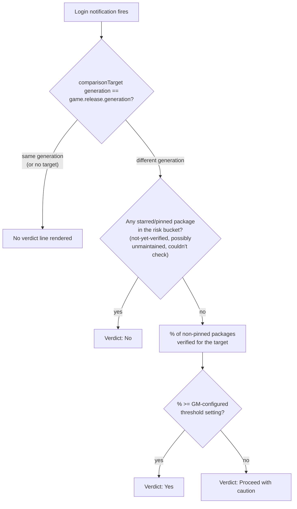

# ADR-0009: "Should I update?" verdict — pinned modules gate, GM-tunable percentage threshold, major-version-only

## Context and Problem Statement

The login notification currently reports raw counts (verified vs. unverified,
updates available) and leaves the "is it actually safe to update Foundry"
judgment entirely to the GM. A quick throwaway prototype
(`postChatSummary` in `scripts/login-notification.js`, plus matching CSS)
explored a synthesized three-way verdict — computed as: any starred/pinned
package with a genuine verification risk forces a hard "No," otherwise
everything is folded into a plain "the rest is unverified" count — and is
currently out for real-world feedback (a GM tester, "Andy," is trying it
against his own modlist).

Before building this for real, three open design questions need settling:

1. How does the verdict fold in the *rest* of the modlist (everything not
   pinned) rather than ignoring it entirely once pins pass?
2. Different GMs have different risk tolerance for that remainder — how does
   a GM express "I'm fine if 50% of my non-critical modules are behind"
   versus "I want 100%, always"?
3. When should this verdict even be computed and shown? A wrong-feeling
   verdict shown on every login, including trivial point-release bumps where
   compatibility essentially never breaks, risks becoming background noise
   the GM learns to ignore — eroding trust in it for the moments it actually
   matters.

## Decision Drivers

* Pinned/starred modules are explicitly GM-flagged as critical (SPEC-0001
  REQ "Pinned Critical Modules") — their state must dominate the verdict,
  never get averaged away by an otherwise-healthy modlist.
* Risk tolerance for the *non-pinned* remainder varies per GM. A fixed
  global threshold (always require 100%) forces a GM who hasn't pinned
  everything into a permanent "no"; a fixed lenient default (say 50%)
  undersells real risk to a cautious GM. This needs a per-world adjustable
  setting, not a constant baked into the code.
* Foundry major/generation upgrades (e.g. v13 -> v14) are the moment
  compatibility actually breaks worlds. A same-generation build bump (e.g.
  13.350 -> 13.351) essentially never does — this project already treats
  `compatibility.verified` and comparison targets at generation granularity
  throughout (ADR-0001's `toGeneration()`, ADR-0002's severity model), so
  reusing that same granularity to gate *whether the verdict renders at all*
  is a natural extension, not new machinery.
* CLAUDE.md rule 4 ("dev-declared, not tested"): a "Yes"/"No" recommendation
  must read as a summary of what the module already knows, never as an
  independent guarantee that an update is safe.
* CLAUDE.md rule 1 (kindness / no false alarms): a verdict that fires
  needlessly on every login is the same "cry wolf" failure mode the
  kindness-language rule already guards against, just aimed at frequency
  instead of wording.

## Considered Options

* Two-tier Yes/No verdict, pins as the sole gate (the prototype, unchanged)
* Three-tier Yes/No/Proceed-with-caution verdict: pins gate straight to
  "No"; a GM-configurable percentage threshold over the rest of the
  modlist separates "Yes" from "Proceed with caution" — computed only when
  the comparison target's generation differs from the running generation
* A single numeric "readiness score" (e.g. a plain 0-100%) instead of a
  categorical verdict
* Keep computing/showing the verdict on every login regardless of whether
  the pending update is a new generation or just a build bump

## Decision Outcome

Chosen option: "Three-tier Yes/No/Proceed-with-caution verdict, pins-first
gate, GM-tunable percentage threshold for the rest, computed only on a
major (generation) version change," because:

* The pins-first gate matches the explicit design intent and the existing
  "pins are critical" precedent already established by ADR-0002's
  hard/soft severity split and SPEC-0001's pinned-modules requirement — a
  starred module with a real risk status is an unconditional "No," full
  stop, never diluted by how clean the rest of the list is.
* A *percentage* threshold (not a fixed count) scales naturally to any
  modlist size and is directly GM-tunable via one new world-scoped
  setting — this is the mechanism that actually answers "someone might
  want 50%, someone else wants 100%," which a hardcoded constant cannot.
* Gating the whole verdict on a generation change reuses infrastructure
  that already exists: `comparisonTarget.value` (from
  `determineComparisonTarget` in `scripts/compatibility-classifier.js`) is
  already normalized to generation granularity via `toGeneration()`, and
  `game.release.generation` is the same granularity for the running
  version. Comparing the two directly answers "is this a major-version
  moment" with no new version-parsing logic — and it targets the verdict
  at exactly the moment ADR-0001/ADR-0002's own reasoning already
  identifies as the one that matters (a newer *generation*, not a newer
  patch build).
* Rejects the numeric-score option: a bare percentage pushes the
  interpretation work back onto the GM, which is exactly what a
  synthesized recommendation exists to avoid (the original ask was
  explicitly "a simple yes/no/maybe kind of response"). A 62% score next
  to one hard-broken pinned module still reads as "pretty good" at a
  glance — actively misleading in a way a hard pins-gate to "No" cannot
  be.

### Consequences

* Good, because GMs with different risk tolerances get a tunable knob
  instead of a hardcoded percentage.
* Good, because it reuses ADR-0001's existing generation-comparison
  infrastructure — no new version-parsing or detection logic required.
* Good, because verdict silence on ordinary point releases avoids alert
  fatigue, preserving trust in the verdict for major-version moments.
* Bad, because it adds a new settings UI surface (a percentage
  input/slider and its world-scoped setting key) beyond what v1 currently
  has (frequency only) — this is real, non-trivial scope on top of the
  notification-only prototype, confirming the user's own expectation that
  "it will need more than just notification settings."
* Bad, because a GM who sets the threshold to 100% and pins nothing can
  never see "Yes" if even one incidental, non-critical module lags —
  likely needs a documented explanation of the knob (settings hint text)
  so it doesn't read as a bug.
* Neutral, because the verdict becomes conditionally absent (no verdict
  line at all on a same-generation login) rather than always rendering one
  of three states — the notification's rendering logic needs an explicit
  fourth "no verdict" case, not just three mutually exhaustive ones.

### Confirmation

Real-world feedback from the current prototype (out for testing with Andy)
validates the underlying concept directionally. Once implemented for real,
compliance is confirmed by dedicated unit tests covering: (a) any
pinned/starred package with a risk status yields "No" regardless of the
overall percentage; (b) the non-pinned percentage exactly at, above, and
below the configured threshold yields "Yes"/"Yes"/"Proceed with caution"
respectively; (c) a same-generation comparison target (or no comparison
target at all) suppresses the verdict entirely — no verdict line rendered;
(d) a different-generation target, no pinned risks, and 100% of the
non-pinned remainder verified yields "Yes" at any threshold setting.

## Pros and Cons of the Options

### Two-tier Yes/No, pins-only gate (the prototype, unchanged)

The current mock: any starred package at risk is "No," otherwise "Yes,"
full stop — the rest of the modlist is only ever summarized as a raw count,
never folded into the verdict itself.

* Good, because it's the simplest to implement — already built and out for
  testing.
* Good, because it needs no new setting.
* Bad, because it throws away all non-pinned signal: a GM with 40 modules
  and only 3 starred gets a flat "Yes" even if 30 of the other 37 are
  unverified, which materially misrepresents real risk.
* Bad, because it doesn't address the user's explicit ask for a
  GM-tunable percentage over the rest of the modlist.

### Three-tier with percentage threshold (chosen)

Pins gate to "No" outright; otherwise compute what percentage of
*non-pinned* packages are verified for the comparison target and compare
against a GM-configurable world setting to decide "Yes" vs. "Proceed with
caution." Computed only when the comparison target represents a different
generation than `game.release.generation`.

* Good, because it matches the stated intent exactly and scales to any
  modlist size.
* Good, because the threshold is tunable per-GM rather than a guess baked
  into the code.
* Good, because pins still act as a hard override — a healthy percentage
  can never paper over a starred module's real risk.
* Bad, because it's more moving parts than the two-tier version: a new
  setting, a percentage computation, and three (really four, counting "no
  verdict") states to design copy and UI for.

### Numeric readiness score

Report a plain percentage (e.g. "73% ready") instead of a categorical
verdict, letting the GM set their own bar mentally rather than configuring
one in settings.

* Good, because it's maximally expressive and needs no threshold setting
  at all.
* Good, because it avoids ADR authors' (or this module's) opinion about
  what percentage counts as "enough."
* Bad, because it pushes interpretation work back onto the GM — the
  original ask was explicitly for "a simple yes/no/maybe kind of
  response," not a number to interpret.
* Bad, because a decent-looking score can coexist with a hard-broken
  pinned module and still read as "pretty good" at a glance, which is
  actively misleading in exactly the way a hard pins-gate prevents.

### Always compute the verdict, every login

Skip the major-version gate entirely; compute and show one of the three
(or four) states on every login, regardless of what kind of Foundry update
is pending.

* Good, because behavior is simpler to reason about — "the verdict is
  always there" has no conditional-absence case to design for.
* Bad, because it fires on every trivial build-level bump, where
  compatibility essentially never breaks by this project's own
  generation-granularity model (ADR-0001, ADR-0002) — becoming ignorable
  background noise for the one moment (a real generation change) it
  actually matters.

## Architecture Diagram

## More Information

* The prototype that motivated this ADR lives in
  `scripts/login-notification.js` (`postChatSummary`'s inline "Should I
  update?" block) and `styles/the-plugin-plugin.css` (the matching
  `verdict-yes`/`verdict-no`/`verdict-maybe` and `verdict-flag` rules) — it
  is an always-computed mock and is expected to be replaced by the design
  this ADR describes, not extended in place.
* **The prototype is committed on this branch**, and `module.json` is
  bumped accordingly, per CLAUDE.md's versioning convention that an
  experimental prototype out for real-world feedback still bumps `version`
  when pushed. Earlier revisions of this ADR described it as "uncommitted,"
  which was true while it was being iterated on locally and stopped being
  true the moment it was committed alongside this file. Committed is not
  the same as decided: what ships here is the mock, not the design below.
* What the mock actually does differs from the Decision Outcome in three
  ways, all deliberate — it has no percentage threshold, no GM setting, and
  no major-version gate. Its middle state ("Maybe") fires whenever *any*
  package is unverified. Do not read the prototype as a partial
  implementation of this ADR; none of the three chosen mechanisms exist
  yet.
* Relates to SPEC-0001 REQ "Login Notification" (will need a REQ addition
  once this ADR is accepted) and REQ "Pinned Critical Modules".
* `determineComparisonTarget`/`toGeneration` in
  `scripts/compatibility-classifier.js` already normalize the comparison
  target to generation granularity — the major-version gate compares that
  value directly against `game.release.generation`, no new parsing needed.
* Open for the eventual spec, not resolved by this ADR: the default
  percentage-threshold value, the exact settings UI copy/control (slider
  vs. number input), and whether this verdict should also surface in the
  checker table window itself rather than only the login notification.
