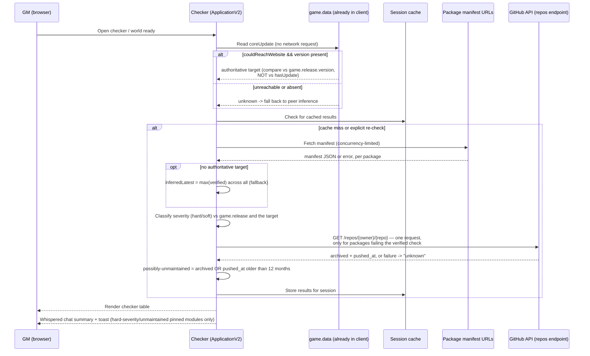

# Design: Compatibility Checker

## Context

Foundry's built-in Pre-Flight Compatibility Checklist only exists on the
pre-login Setup screen, so GMs who stay logged into their world never see
it. This capability closes that gap by running the same kind of check
in-world, GM-only, entirely client-side.

Accepted ADRs constrain this design directly:

- **ADR-0001** (as amended 2026-08-15): Foundry *does* expose the latest
  core version to a running world, at `game.data.coreUpdate.version` — the
  local Node server performs the license-authenticated check and relays the
  result into the client's game data, so the module reads it without any
  network request, credential, or CORS exposure. The comparison target is
  therefore authoritative when available. Peer inference (`inferredLatest`,
  the highest `compatibility.verified` across the GM's installed packages)
  is retained as the **fallback** for when `couldReachWebsite` is `false`
  or the payload is absent.

  *Earlier revisions of this document asserted the opposite — that no such
  field existed. That claim originated in
  `docs/research/foundry-version-detection.md`, which never enumerated
  `game.data` before asserting the absence. Both documents now carry dated
  corrections.*
- **ADR-0002**: a `compatibility.verified` lag alone is weak evidence — it
  usually just means a developer hasn't updated manifest bookkeeping, not
  that their package is broken. Severity escalation (toasts, summary
  "problem" counts) is gated on `compatibility.maximum`, Foundry's own
  hard ceiling, which is an actual developer claim rather than an
  inference.
- **ADR-0004**: the "possibly unmaintained" heuristic measures repository
  activity age, not whether a version string changed between two checks.
  The earlier signal fired on the second check of any session regardless of
  real staleness, which risked exactly the false accusation ADR-0002 exists
  to prevent.

`docs/research/mcc-research.md` documents the prior art this design
deliberately diverges from: `arcanistzed/mcc` depended on a Cloudflare
Worker, a community-maintained Google Sheet, and a privileged
foundryvtt.com API key, and died when that standing infrastructure and
community effort faded. Every design choice here — no server, no
credentials, no crowdsourced data — traces back to that failure mode.

## Goals / Non-Goals

### Goals

- Fully automatic compatibility and update-availability signal, requiring
  no GM action and no external service.
- Never present a developer-declared claim (from a manifest) as if it were
  independently tested or verified by anyone but that developer.
- Never use language that frames a lagging or unmaintained-looking package
  as "dead," "broken," or "abandoned."
- Keep the entire capability client-side: no server component, no API
  keys, no crowdsourced data source.

### Non-Goals

- Transitive `relationships.requires` dependency expansion (explicitly
  deferred to v1.5 per CLAUDE.md).
- Auto-updating modules — this capability only reports status, never
  installs or modifies packages.
- Setup-screen integration — this capability is entirely in-world.
- A proxy or relay server of any kind, even a minimal one — ruled out by
  ADR-0001's option analysis and CLAUDE.md project rule 5.
- Asking a GM for their Foundry license key or any other credential, to
  reach the license-authenticated `/_api/packages/get` endpoint discussed
  in ADR-0001 — explicitly rejected there as an "API key" by any
  reasonable definition, and a genuine security/privacy concern
  independent of that framing.

### Note on the Security Requirements section

This spec's `## Requirements` section does not include a "Security
Requirements" section, even though the capability involves fetching data
over HTTP and rendering UI. This module has no server component of its
own — no HTTP endpoints, no routes, no auth boundary, nothing that
receives a request from anyone. It only ever makes outbound `fetch()`
calls, as a client, to third-party manifest URLs and the GitHub API. The
standard web-security template (endpoint auth, CSRF, rate limiting,
redirect validation) has no referent here; injecting it would document
controls that don't apply to anything in this system. The Accessibility
Requirements section *is* included, since the checker window is real
browser-rendered UI a GM interacts with directly.

## Decisions

### The comparison target is read, not inferred, whenever Foundry supplies it

**Choice**: Take the comparison target from `game.data.coreUpdate.version`,
falling back to peer inference only when `couldReachWebsite` is `false` or
the payload is absent.

**Rationale**: Foundry's own server already ran the license-authenticated
update check and put the answer in the client's game data. Inferring a
value we can simply read would be strictly worse: less accurate, and no
cheaper — reading costs zero requests.

Two field-level traps are load-bearing enough to state here rather than
leave to implementation, because both fail *silently*:

- **`hasUpdate` is not the signal.** It reported `false` on a world running
  13.351 while `version` reported `14.366`, apparently scoped to the
  running generation. Gating on it would suppress precisely the
  cross-generation signal this capability exists to surface. Compare
  `coreUpdate.version` to `game.release.version` directly.
- **`couldReachWebsite: false` means unknown, not current.** Treating a
  failed check as "you're up to date" would assert the one thing ADR-0001
  has always refused to assert.

**Alternatives considered**:
- Keep peer inference as the primary mechanism: rejected — it was only ever
  a workaround for a constraint that does not exist.
- Drop peer inference entirely: rejected — `couldReachWebsite` can be
  `false` on an offline or firewalled server, and inference degrades
  gracefully to "no evidence" there, which is better than no target at all.

### `inferredLatest` computed from the same fetch pass as the update check

**Choice**: When used as the fallback, `inferredLatest` is computed as a
pure derived value — `max(compatibility.verified)` across all manifests
already fetched for the Requirement: Manifest Check pass — rather than a
separate fetch or check.

**Rationale**: Zero additional network cost, and it keeps the "no new
infrastructure" property from ADR-0001 literally true in the
implementation, not just the decision record.

**Alternatives considered**:
- A dedicated "version check" pass, fetching a curated list of bellwether
  packages: rejected — adds a second fetch pass and a maintained list of
  bellwether package IDs for no benefit over just using everything the GM
  already has installed.

### Maintenance is measured on the repository, not on our own observations

**Choice**: The "possibly unmaintained" heuristic reads `pushed_at` from
the same `GET /repos/{owner}/{repo}` response already fetched for
`archived`, and flags at 12 months of no activity.

**Rationale**: The prior signal — "the version string did not change
between two checks" — measured the observer, not the project. It fired on
the second check of any session, which is why a maintained package was
mislabeled in live testing (issue #22). Repository activity is a property
of the project itself and is available on the first check a world ever
runs, with no stored baseline and no extra request.

This also retires the `previousPackageVersions` world setting, whose only
consumer was the frozen-version comparison.

**Alternatives considered**:
- Add an elapsed-time floor to the stored version baseline: rejected —
  requires changing a live world setting's shape plus a migration, and
  cannot fire until a baseline ages, so a fresh install learns nothing for
  a year.
- Require `archived` alone: rejected — most dormant projects are never
  archived, so the heuristic would almost never fire.

### Severity is a derived classification, not a stored field

**Choice**: Hard/soft severity (ADR-0002) is computed at check-time from
`compatibility.maximum` and the comparison target, not stored as
persistent state.

**Rationale**: Comparison targets (`game.release`, `inferredLatest`)
change on every check; storing a stale severity classification would risk
it drifting from the manifest data it's derived from. KISS: recompute
every time.

**Alternatives considered**:
- Cache severity per package across sessions: rejected — the Requirement:
  Fetch Concurrency and Caching requirement already caches raw fetch
  *results* for the session; caching a derived classification on top adds
  a second cache to keep in sync for no real performance benefit, since
  the classification computation itself is cheap (a version-string
  comparison, not a network call).

### GitHub `archived` lookup is scoped to already-failing packages only

**Choice**: The "possibly unmaintained" heuristic only queries the GitHub
API for packages that have already failed the verified-compatibility
check, per the spec's Requirement: Possibly Unmaintained Heuristic.

**Rationale**: Keeps the unauthenticated GitHub API call volume
proportional to actual candidates, respecting rate limits, and avoids
spending a GitHub API call on every installed package when most will never
need the "possibly unmaintained" classification at all.

**Alternatives considered**:
- Query `archived` for every GitHub-hosted package up front: rejected —
  needlessly burns rate-limit budget on packages that already pass the
  verified check and can never reach "possibly unmaintained" status.

## Architecture

The GitHub interaction is deliberately drawn as a **single** request
yielding both signals — issuing a second call for activity age would spend
rate-limit budget on data already in hand (ADR-0004).

## Risks / Trade-offs

- **`inferredLatest` produces false negatives when the GM's whole modlist
  is uniformly behind** → Accepted per ADR-0001, and now much rarer: this
  only applies on the fallback path, when Foundry's own update check was
  unreachable. It still degrades to "no peer signal," identical to having
  no target-version check at all, not a false "you're all set."
- **The authoritative target depends on a Foundry-internal data shape**
  (`game.data.coreUpdate`) rather than a documented module API → Accepted:
  the fallback already exists and covers a missing or renamed payload, so
  the failure mode is degradation to inference rather than breakage. Worth
  re-checking on each Foundry generation.
- **The unmaintained heuristic is silent for non-GitHub packages** →
  Accepted per ADR-0004: activity age is only observable for GitHub-hosted
  repositories, so GitLab and self-hosted packages yield "unknown"
  permanently. This trades breadth for correctness — the previous
  host-agnostic signal was wrong everywhere rather than silent somewhere.
- **Hard/soft severity under-flags real breakage when a developer knew
  about it but never set `compatibility.maximum`** → Accepted per
  ADR-0002: erring toward not nagging over erring toward alarming on an
  unconfirmed claim, consistent with project rule 1 (kindness to
  developers).
- **GitHub API rate limits (60/hour unauthenticated)** → Mitigated by
  scoping `archived` lookups to already-failing packages only, and by
  session caching so repeated checkers windows within a session don't
  re-query.
- **A GM with many installed packages could see a slow initial scan** →
  Mitigated by the concurrency cap (Requirement: Fetch Concurrency and
  Caching) and session-level caching so the cost is paid once per session,
  not once per checker-window open.

## Migration Plan

Greenfield — no prior version of this capability exists in this repo.

## Open Questions

None remaining — both questions raised during design have been resolved
during implementation (see "Resolved Questions" below).

## Resolved Questions

- **What is the right concurrency-limit number for manifest fetches?**
  Resolved as `DEFAULT_CONCURRENCY = 6` in `scripts/manifest-fetcher.js`
  (issue #6 / PR #11). Rationale documented inline at that constant's
  definition.
- **Should the frequency-setting comparison hash include soft-severity
  packages, or only hard-severity + unmaintained?** Resolved: the hash
  includes every field the chat summary itself reports, i.e. all
  severities, not just the toast-eligible subset — "the results changed"
  means everything the notification describes. Implemented in
  `hashResults` in `scripts/login-notification.js` (issue #9 / PR #13);
  rationale documented in that function's docstring. The toast's own
  gating remains separately governed by `shouldShowToast`/ADR-0002
  regardless of what the hash includes.
