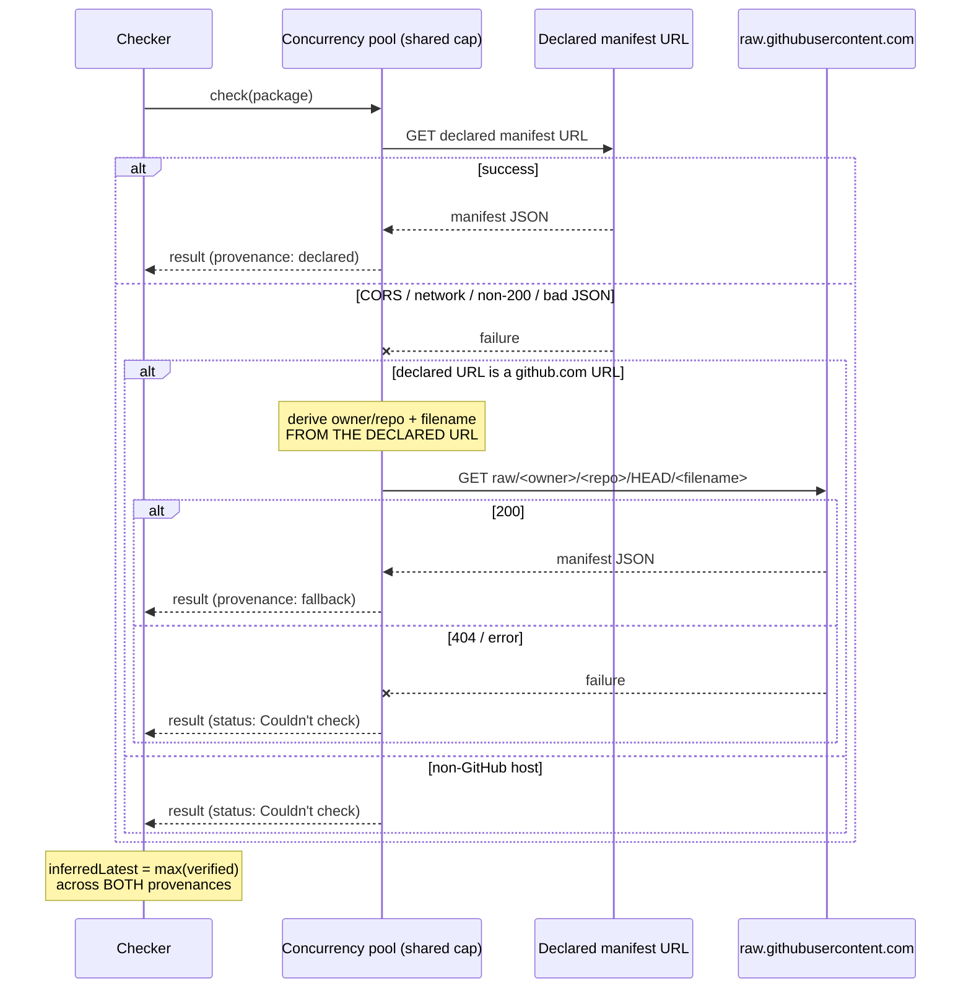

# Design: Manifest Fetch Fallback

## Context

SPEC-0001's manifest check was built on the assumption that a package's
declared `manifest` URL is fetchable from a browser. The first real-world
run of the checker (Foundry v13.351, Starfinder world, five active
third-party modules plus the game system) disproved that assumption: six of
seven packages failed with `Failed to fetch`.

The cause is structural rather than incidental, and is documented in
ADR-0003. The dominant Foundry manifest convention,
`github.com/<owner>/<repo>/releases/latest/download/<file>`, returns a
302 → 302 → 200 chain in which no response carries an
`Access-Control-Allow-Origin` header. The single package that succeeded
declared a `raw.githubusercontent.com` URL, which returns
`access-control-allow-origin: *`. Both behaviors were verified with GET
requests following redirects, not merely HEAD probes.

This capability implements ADR-0003's accepted decision. It extends
SPEC-0001 rather than superseding it: the declared URL stays primary, and
SPEC-0001's error isolation, concurrency cap, and session cache all remain
in force.

## Goals / Non-Goals

### Goals

- Recover usable manifest data for GitHub-hosted packages whose declared
  URL is CORS-blocked, without a server, credentials, or new dependency.
- Restore ADR-0001's `inferredLatest` to working order by giving it enough
  manifest data to find a peer signal.
- Keep fallback-sourced data honestly distinguishable from released data,
  so the checker never overstates what a developer shipped — and, where a
  field cannot support that honestly, decline to use it at all rather than
  label it more carefully (REQ "Fallback Field Trust").

### Non-Goals

- Complete coverage. The fallback cannot serve non-GitHub hosts, and cannot
  serve packages whose manifest is a build artifact absent from the
  repository root. Those remain "Couldn't check" — see Risks.
- Resolving the exact released manifest. That would require GitHub API tag
  resolution, considered and rejected in ADR-0003 on rate-limit grounds.
- Any proxy, relay, or credential collection — ruled out by CLAUDE.md rule
  5 and ADR-0001.
- Changing SPEC-0001's status taxonomy. A package the fallback cannot serve
  reports the existing "Couldn't check" status; no new label is introduced.

## Decisions

### Derive the repository from the declared URL, never from the manifest body

**Choice**: Parse `<owner>/<repo>` out of the package's declared `manifest`
URL, which is available locally from `game.modules`.

**Rationale**: The obvious source for a repository URL is the manifest's
own `url` or `bugs` field — and that is exactly wrong here. Those fields
live inside the manifest body, which is unavailable precisely on the code
path where the fallback is needed. Sourcing from the body would create a
circular dependency that only surfaces at runtime, on the failure path,
where it is least likely to be caught by a hasty test.

**Alternatives considered**:
- Read `links.url` from the fetched result: rejected — `links` is `null` on
  error results by construction, so this can never work for the case it
  would be needed in.
- Ask the GitHub API to resolve the repository: rejected — spends
  rate-limit budget to obtain information already present in the declared
  URL.

### Carry the filename through rather than assuming `module.json`

**Choice**: Take the final path segment of the declared URL and reuse it in
the derived URL.

**Rationale**: Game systems declare `system.json`. Hardcoding
`module.json` would silently break every system — including `sfrpg`, the
very system this was first tested against. The failure would be a 404
indistinguishable from a legitimate miss, so it would likely be
misdiagnosed as "the fallback just doesn't work for systems."

### Fallback-sourced values participate in `inferredLatest`

**Choice**: Include `compatibility.verified` from fallback-sourced
manifests when computing `inferredLatest`.

**Rationale**: Consistency — once a manifest has been resolved, the source
it came from should not change how its `verified` value is treated.
Excluding fallback-sourced values would make the peer signal depend on
which packages happened to have CORS-friendly manifest URLs, which is
unrelated to how current those packages are.

> **Amended 2026-08-15.** This rationale originally argued that excluding
> these values "would preserve the exact failure this work exists to fix,"
> because `inferredLatest` would stay `null` and ADR-0001's inference would
> never run. That framing was correct when written but is now overstated:
> ADR-0001 has since been amended, and the comparison target normally comes
> from `game.data.coreUpdate.version` — authoritative, and needing no
> manifest data at all. Peer inference is now the *fallback*, used only
> when Foundry's own update check was unreachable. So this requirement
> still matters, but it improves a fallback path rather than rescuing the
> primary one. The measured example still holds: `lib-wrapper` and
> `smarttarget` both declare `verified: 14` and are only reachable via the
> fallback.

The accuracy objection (default-branch values may be aspirational) is
already absorbed by two accepted decisions: ADR-0001 frames
`inferredLatest` as advisory inference rather than ground truth, and
ADR-0002 gates severity escalation on `compatibility.maximum` rather than
on `verified`. A slightly optimistic `verified` therefore cannot, on its
own, escalate a notification.

**Alternatives considered**:
- Exclude fallback values from `inferredLatest`: rejected — makes the peer
  signal depend on an irrelevant property (manifest-host CORS policy)
  rather than on package currency.
- Include them but discount them (e.g. require two corroborating peers):
  rejected as premature — ADR-0002's severity gate already prevents a
  single optimistic peer from causing user-visible alarm, so a second
  mechanism would add complexity without a demonstrated failure to prevent.

### A fallback manifest is trusted field by field, not as a unit

**Choice**: Use `compatibility.verified` (and legacy
`compatibleCoreVersion`), `url`, `bugs` and `changelog` from a
fallback-sourced manifest; treat its `version` as unknown.

**Rationale**: The two fields have different reliability, for a mechanical
reason. Comparing `Smart-Target`'s released and committed manifests
directly:

```
RELEASED  (releases/latest/download/module.json): version=4.0.0  verified=14
COMMITTED (raw.githubusercontent.com/HEAD)      : version=0.5.1  verified=14
```

`version` differs by three major versions; `verified` is identical. Release
tooling stamps `version` at tag time, so the committed value is a
placeholder nobody maintains — this project's own `release.yml` does the
same. `compatibility.verified` is hand-edited in the committed file, which
is exactly why it stays current.

The original design treated a fetched manifest as one trustworthy object.
That produced the worst available failure: a GM told they were up to date
while three major versions behind. Between over-alarming and a false
all-clear, the false all-clear is the one that never gets checked.

**Alternatives considered**:
- Fetch the real version from the GitHub API (`releases/latest` → tag):
  rejected — accurate, but spends the 60/hr unauthenticated budget ADR-0003
  deliberately reserved for the unmaintained heuristic. A large modlist
  could exhaust it and degrade both features at once, in a confusing
  time-dependent way.
- Trust the fallback `version` only when it is newer than installed:
  rejected — a stale placeholder that happens to be higher passes the guard
  and still reports wrongly. Plausibility is not evidence, and the spec
  rejects this implementation by name.
- Keep surfacing the version but label it more loudly: rejected — the row
  that caused this was already correctly labelled. Labelling had its
  chance.

**Cost, accepted**: update availability is lost for every fallback-sourced
package — 3 of 7 in the tested world — and a package whose committed
`version` happens to be accurate is penalised alongside those where it is
not. There is no way to distinguish them without the API call above.

### Provenance is a first-class field, not a UI afterthought

**Choice**: Record `declared` vs `fallback` on the result object, and drive
the UI marking from it.

**Rationale**: ADR-0003's Confirmation section requires the distinction be
visible. Carrying it in the data model rather than inferring it at render
time keeps the checker table, the login notification, and any future
consumer consistent, and makes the requirement testable without a browser.

**Alternatives considered**:
- Infer provenance at render time by re-parsing the URL: rejected — derives
  the same fact twice from different inputs, which is how the two views
  drift apart.

## Architecture



Both attempts occur inside the existing pool, so the concurrency cap
governs total in-flight requests rather than per-package attempts — a
package that falls back consumes its slot twice in sequence, never twice
concurrently.

## Risks / Trade-offs

- **Default-branch data is not release data, in either direction.** The
  original framing of this risk assumed the default branch would be *ahead*
  of the latest release, and treated provenance marking as the mitigation.
  Live testing disproved both halves: `Smart-Target` reported a fallback
  version of `0.5.1` against an installed `0.9.8` and a real latest release
  of `4.0.0`, on a row that *was* correctly marked → Mitigated by REQ
  "Fallback Field Trust", which removes the unreliable field from use
  entirely rather than relying on the GM to read a label. Marking remains
  necessary; it was never sufficient.
- **Coverage remains partial and uneven.** Measured recovery is 1/7 → 4/7.
  Game systems that build their manifest (`sfrpg`) and non-GitHub hosts
  (`pings`, `settings-extender` on GitLab) gain nothing → Accepted, and
  stated plainly in ADR-0003 rather than rounded up. The remaining misses
  degrade to the same "Couldn't check" they already showed.
- **Coupling to one forge's URL layout.** The derivation encodes knowledge
  of `github.com` path structure, which will rot if GitHub changes its
  conventions → Accepted as the cost of the only credential-free option;
  isolated to a single derivation function so the blast radius is small.
- **Doubling requests on a fully-failing modlist.** A modlist where every
  package fails issues up to twice the requests → Mitigated by reusing the
  existing concurrency cap, so wall-clock cost grows but in-flight load does
  not.
- **Two specs now govern one fetch path.** SPEC-0001 and SPEC-0002 must stay
  aligned → Mitigated by the `extends` edge and by this spec deliberately
  not restating SPEC-0001's requirements, only stating how the fallback
  interacts with them. `/sdd:check` and `/sdd:audit` are the backstop.

  One such misalignment was found and resolved during review of this spec,
  and is worth recording as the pattern to expect: SPEC-0001 states the
  system "MUST NOT re-fetch a package's manifest ... more than once per
  session." Read literally, a fallback attempt is a second request for the
  same package and would violate that MUST NOT — even though SPEC-0001's
  own scenario makes clear the clause is about repeated checks across
  window opens, not attempts within one check. Left implicit, this would
  surface later as a false-positive CRITICAL drift finding against an
  approved spec. REQ "Concurrency and Caching Interaction" now states the
  scoping explicitly rather than relying on a reader inferring intent.

## Migration Plan

Additive. No stored data changes shape, and no GM-facing setting is added.

The one migration-adjacent concern is the session cache: entries created
before this capability ships carry no provenance field. Since the cache is
in-memory and session-scoped (SPEC-0001 REQ "Fetch Concurrency and
Caching"), it is empty on every page load, so no cache migration or
versioning is required. Implementations MUST NOT persist the cache across
sessions without revisiting this.

Rollback is removal of the fallback attempt; behavior returns to
declared-URL-only, and every package the fallback had been serving reverts
to "Couldn't check".

## Open Questions

- Should the provenance marking distinguish "default branch is ahead of the
  latest release" from "default branch matches the latest release"? The
  GitHub API could establish this, but at the rate-limit cost ADR-0003
  rejected. Deferred until there is evidence GMs are actually misled by the
  undifferentiated marking.
- Should a package whose fallback 404s record *why* (manifest absent from
  the repository root) distinctly from a network failure? Both currently
  collapse to "Couldn't check". A distinction would help package authors
  reading a copied bug report, but adds a status nuance SPEC-0001's
  taxonomy does not currently carry.
